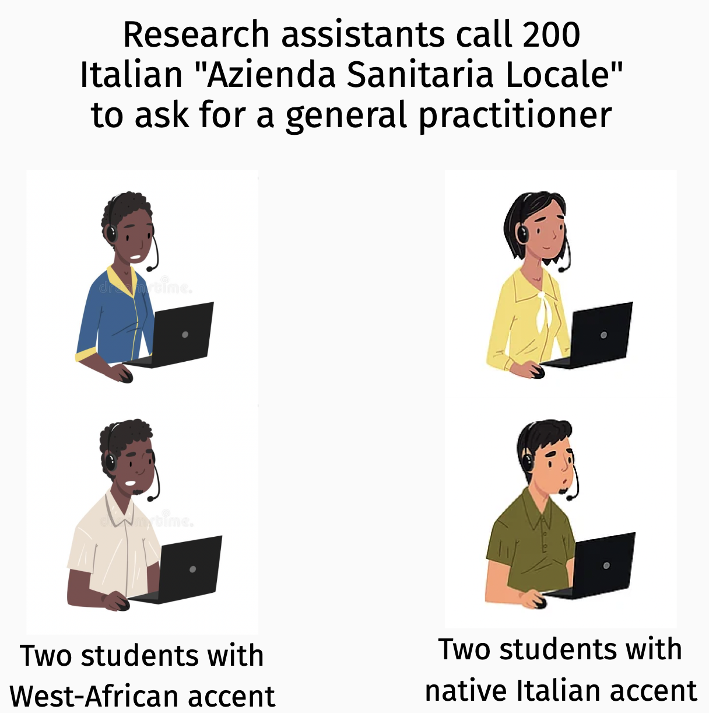
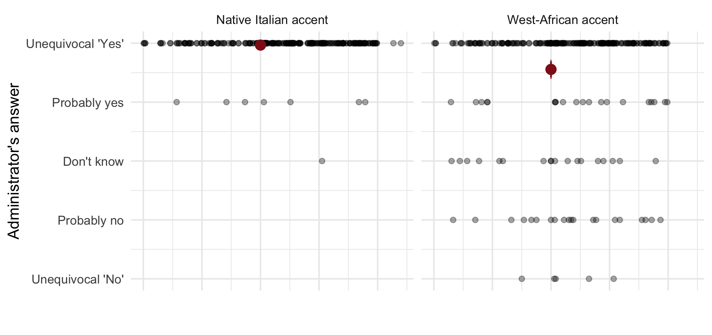
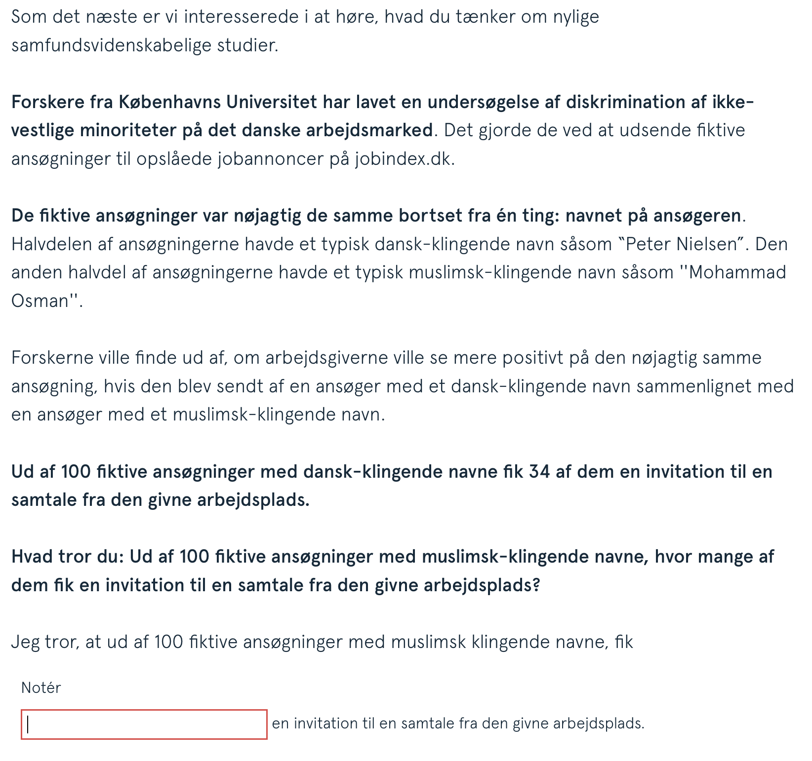
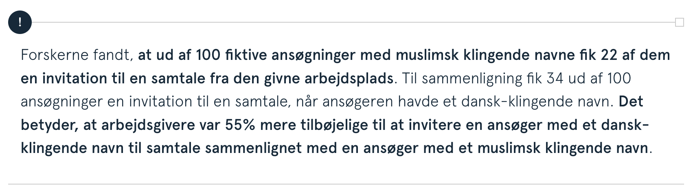
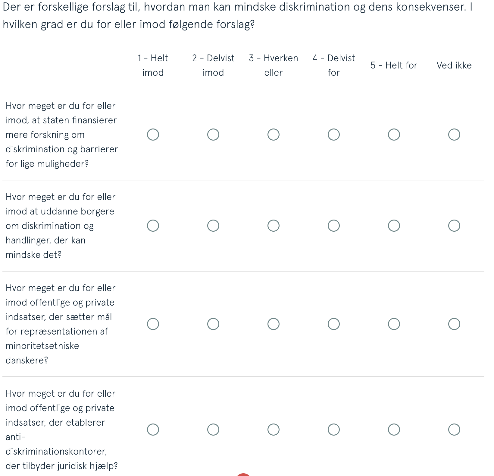
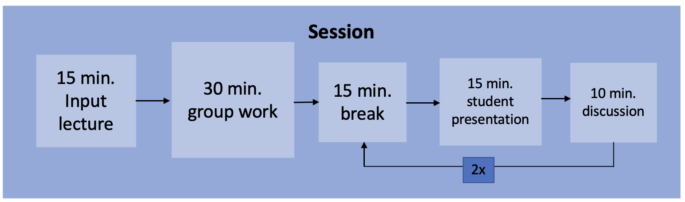
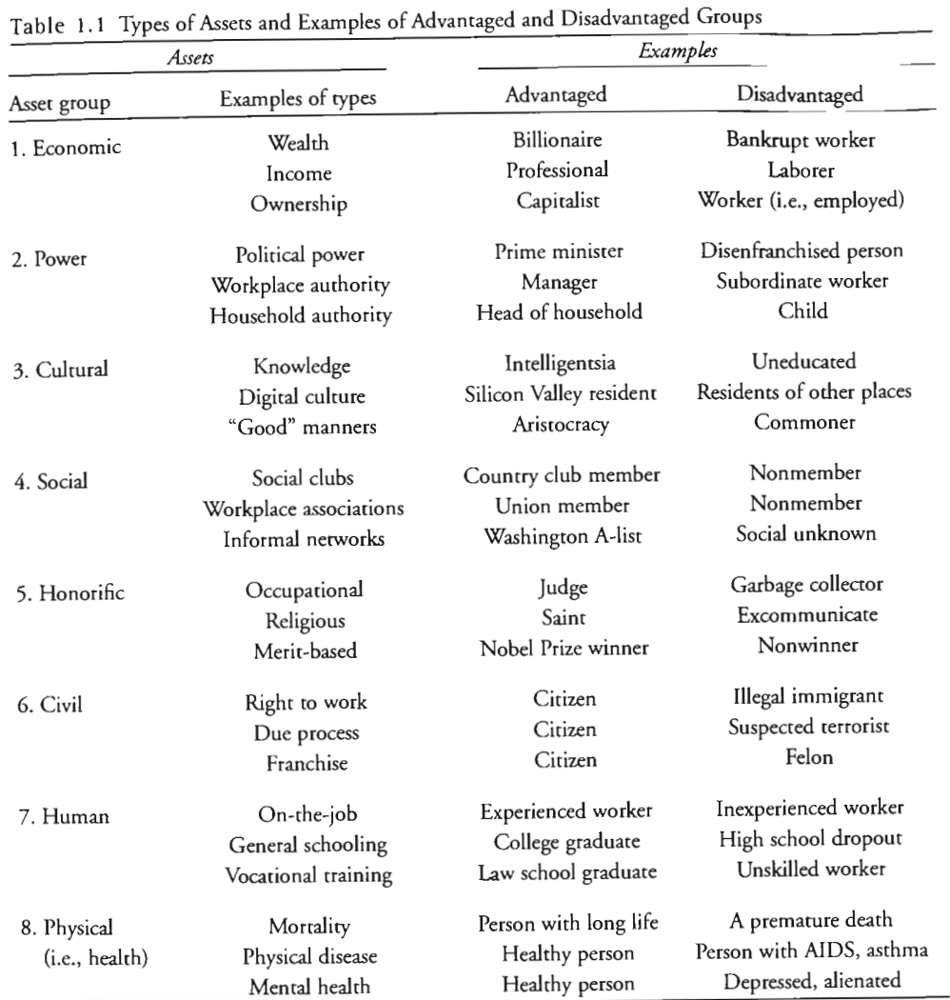

```{r setup, include = FALSE}
library(RefManageR)
library(knitr)

options(htmltools.dir.version = FALSE, servr.interval = 0.5, width = 115, digits = 3)
knitr::opts_chunk$set(
  collapse = TRUE, message = FALSE, fig.retina = 3, error = TRUE,
  warning = FALSE, cache = FALSE, fig.align = 'center',
  comment = "#", strip.white = TRUE, tidy = FALSE)

BibOptions(check.entries = FALSE, 
           bib.style = "authoryear", 
           style = "markdown",
           hyperlink = FALSE,
           no.print.fields = c("doi", "url", "ISSN", "urldate", "language", "note", "isbn", "volume"))
myBib <- ReadBib("./../../../Adv-WIM.bib", check = FALSE)

xaringanExtra::use_xaringan_extra(c("tile_view", "tachyons"))
xaringanExtra::use_panelset()
```
class: middle center
background-image: url("https://stanfordbloodcenter.org/wp-content/uploads/2021/01/iStock-1208283967.jpg")
background-position: center
background-size: cover

.font160[
**My research agenda**
]
.font200[
**Theory-driven empirical analysis of <br> <br> immigration-based ethnic diversity and stratification, <br> <br>& their contentious political consequences**
]

---
layout: true
# Some of my current work

---
.left-column[
```{r, echo = FALSE, out.width='100%'}
knitr::include_graphics('https://www.templehealth.org/sites/default/files/styles/without_crop/public/2021-01/man-wearing-mask-coughing-into-shoulder.jpg?itok=Z6mUgWPd')
```
]


.right-column[
> In the following you are asked to take a stand on the case of **[name]** who has lived in Denmark **[length of residence]**. **[Name]** has been tested positive for COVID-19 (Corona virus) and later developed severe symptoms such as fever, fatigue, dry coughs, breathing difficulties, and chest pains. He is **[age]**. The doctor who examined **[name]**, assessed that he needs treatment. However, given the increased pressure the healthcare system is experiencing, **[name]** might be admitted a hospital bed at the expense of someone else.

> Based on the above scenario, to what degree do you feel this person should be prioritized a hospital bed?
]

---

```{r, echo = FALSE, out.width='80%'}
knitr::include_graphics('https://www.tandfonline.com/na101/home/literatum/publisher/tandf/journals/content/cjms20/2021/cjms20.v047.i07/1369183x.2020.1860742/20220705/images/large/cjms_a_1860742_f0001_oc.jpeg')
```
.center[.backgrnote[*Source*: `r Citet(myBib, "larsen_healthcare_2021")`]]

---

```{r, echo = FALSE, out.width='45%'}

```
.center[.backgrnote[*Source*: `r Citet(myBib, "krakowski_populist_2022")`]]

---

```{r, echo = FALSE, out.width='80%'}

```
.center[.backgrnote[*Source*: `r Citet(myBib, "krakowski_populist_2022")`]]

---


```{r, echo = FALSE, out.width='50%'}

```

---

```{r, echo = FALSE, out.width='50%'}

```

---

```{r, echo = FALSE, out.width='48%'}

```

---
layout: false
class: inverse middle
# This 1/2 course

.push-left[
- Explanations of inequality
  + Focus on *inequality-generating mechanisms*.
  + From micro to meso mechanisms.<br>(Carsten will cover macro level in part 2/2)


- Session structure
```{r, echo = FALSE, out.width='100%'}

```


- 2 Portfolios
  1. 15 minute presentation with fellow student.
  2. 5-10 .backgrnote[(+50% per additional student)] page essay: Compare the applicability and explanatory power of two inequality generating mechanisms (from our six sessions) to explain an inequality phenomenon from our list.
]

.push-right[
<iframe src='https://merlin-advanced-wim.netlify.app/' width='1000' height='600' frameborder='0' scrolling='yes'></iframe>
]

---
# Reading questions

.push-left[
- *Theory*: What is the key inequality-generating mechanism proposed in this text?
- *Comparison to other theories*: How does the theory and the propopsed mechanism compare to others that we have already discussed in class, or which you know from other courses? Is it complementary, contradictory, is it an extension?
- *Generalization*: Which phenomena could the proposed inequality-genearating mechanism help to explain. Especially think about the topics we cover in group discussions throughout the course.
]

.push-right[
```{r, echo = FALSE, out.width='100%'}
knitr::include_graphics('https://img.jakpost.net/c/2020/03/01/2020_03_01_87874_1583031914._large.jpg')
```
]

---
layout: true
# List of inequality phenomena

.push-left[
```{r, echo = FALSE, out.width='85%'}

```
.center[.backgrnote[*Source*: `r Citet(myBib, "grusky_stories_2018")`]]
]

---

.push-right[.content-box-green[
- Have rigid classes dissolved into gradual inequalities?

- Has class-based behavior and taste dissolved?

- Are new forms of inequality orthogonal to class?
]]

---

.push-right[
<iframe src='https://www.allourideas.org/advanced-WIM' width='600' height='500' frameborder='0' scrolling='yes'></iframe>

[.alert[.center[Or click here!]]](https://www.allourideas.org/advanced-WIM)
]

---
layout: false
class: inverse middle
# Distribution of 10-15 minute presentations

.push-left[
Your task is to present the study as if you were a scientific adviser to a political party, a foundation, or an NGO. Imagine you have read the new study and are convinced of its societal relevance. 

[...] 

your presentation needs to be pointed, easily understandable and convincing.
]

.push-right[
- Brief intro to topic and its relevance,

- Brief elaboration of core theoretical argument,

- Explanation of study design,

- Correct interpretation of results,

- Presentation style (timing, speed, pronunciation, etc.),

- Visualization (photos, graphics, etc.).
]
---
# References

.font80[
```{r ref, results = 'asis', echo = FALSE}
PrintBibliography(myBib)
```
]
