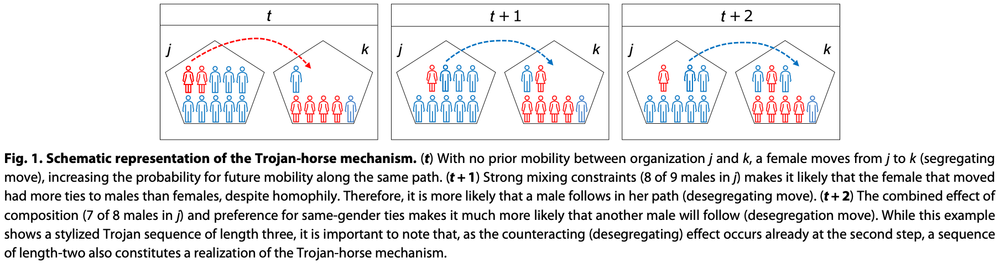

class: center middle
```{r setup, include=FALSE}
options(htmltools.dir.version = FALSE, servr.interval = 1, width = 115)
knitr::opts_chunk$set(collapse = TRUE, message = FALSE, warning = FALSE)
library(RefManageR)
library(tidyverse) # Just check it out: www.tidyverse.org
library(dagitty) # Use the dagitty package
library(ggdag) # Neat visualization of DAGs

options(htmltools.dir.version = FALSE, servr.interval = 0.5, width = 115, digits = 2)
knitr::opts_chunk$set(
  collapse = TRUE, message = FALSE, fig.retina = 3,
  warning = FALSE, cache = FALSE, fig.align='center',
  comment = "#", strip.white = TRUE)

BibOptions(check.entries = FALSE, 
           bib.style = "authoryear", 
           style = "markdown",
           hyperlink = FALSE,
           no.print.fields = c("doi", "url", "ISSN", "urldate", "language", "note", "isbn", "volume"))
myBib <- ReadBib("./../../../Adv-WIM.bib", check = FALSE)

xaringanExtra::use_xaringan_extra(c("tile_view", "tachyons"))
xaringanExtra::use_panelset()
```
# Segregation & Trojan horses
.left-column[
.content-box-green[
What is the Trojan Horse mechanism and how does it work?
]]

.right-column[
```{r, echo = FALSE, out.width='100%', fig.align='center'}

```
.center[.backgrnote[
*Source*: `r Citet(myBib, "arvidsson_trojan-horse_2021")`
]]]

---
# Segregation & Trojan horses
.left-column[
.content-box-green[
What do we learn from Figure 2A, 2B, and 2C respectively?
]]

.right-column[
```{r, echo = FALSE, out.width='100%', fig.align='center'}

```
.center[.backgrnote[
*Source*: `r Citet(myBib, "arvidsson_trojan-horse_2021")`
]]]

---
# Segregation & Trojan horses

```{r, echo = FALSE, out.width='90%', fig.align='center'}

```
.center[.backgrnote[
*Source*: `r Citet(myBib, "arvidsson_trojan-horse_2021")`
]]

---
layout: false
# References

.font80[
```{r ref, results = 'asis', echo = FALSE}
PrintBibliography(myBib)
```
]