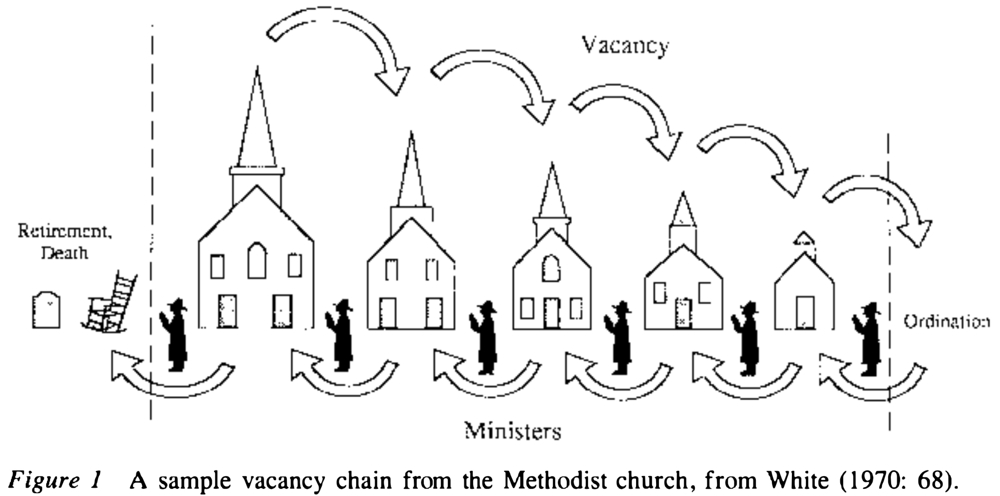
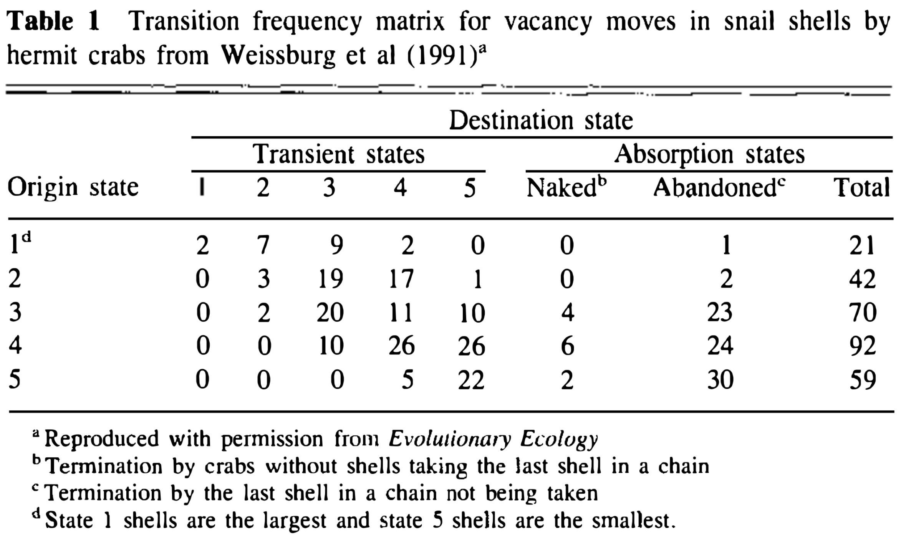
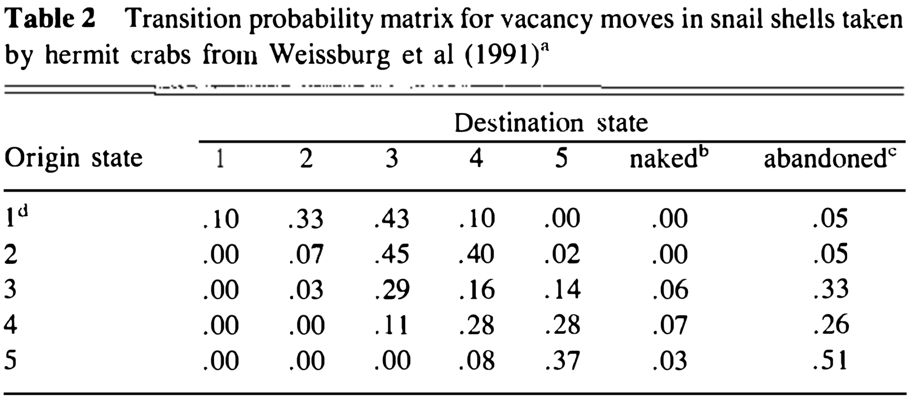
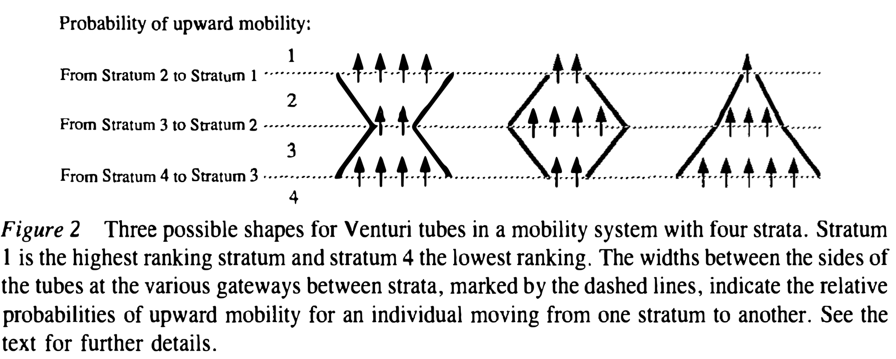

class: center middle
```{r setup, include=FALSE}
options(htmltools.dir.version = FALSE, servr.interval = 1, width = 115)
knitr::opts_chunk$set(collapse = TRUE, message = FALSE, warning = FALSE)
library(RefManageR)
library(tidyverse) # Just check it out: www.tidyverse.org
library(dagitty) # Use the dagitty package
library(ggdag) # Neat visualization of DAGs

options(htmltools.dir.version = FALSE, servr.interval = 0.5, width = 115, digits = 2)
knitr::opts_chunk$set(
  collapse = TRUE, message = FALSE, fig.retina = 3,
  warning = FALSE, cache = FALSE, fig.align='center',
  comment = "#", strip.white = TRUE)

BibOptions(check.entries = FALSE, 
           bib.style = "authoryear", 
           style = "markdown",
           hyperlink = FALSE,
           no.print.fields = c("doi", "url", "ISSN", "urldate", "language", "note", "isbn", "volume"))
myBib <- ReadBib("./../../../Adv-WIM.bib", check = FALSE)

xaringanExtra::use_xaringan_extra(c("tile_view", "tachyons"))
xaringanExtra::use_panelset()
```
layout: true
class: left
# Vacancy chains

.right-column[
```{r, echo = FALSE, out.width='90%'}

```
]

---

.left-column[.content-box-green[
What is the central idea of Vacancy Chain Theory?
]]

---

.left-column[.content-box-green[
What is the central idea of Vacancy Chain Theory?
]

> A vacancy chain is simply the sequence of moves that a vacancy makes from initial entry into a system to final termination.

> -- `r Citet(myBib, "chase_vacancy_1991", after  = ", page 135")`
]

---

.left-column[.content-box-green[
On which assumptions does acancy Chain Theory rely?
]]

---

.left-column[.content-box-green[
On which assumptions does acancy Chain Theory rely?
]
> [...] the resource units in question are reusable, discrete, identifiable, and utilized by one individual or social group at a time.

> -- `r Citet(myBib, "chase_vacancy_1991", after  = ", page 135")`
]

---

.left-column[.content-box-green[
Apart from jobs, which other phenomena could this be applied to?
]
> [...] the resource units in question are reusable, discrete, identifiable, and utilized by one individual or social group at a time.

> -- `r Citet(myBib, "chase_vacancy_1991", after  = ", page 135")`
]

---
layout: false
# Mobility matrices

.left-column[
```{r, echo = FALSE, out.width='90%'}
knitr::include_graphics('https://madlyodd.com/wp-content/uploads/2019/09/og2-A-Family-of-Hermit-Crabs-Line-Up-By-Size-to-Exchange-Shells.png
')
```
]

.right-column[
```{r, echo = FALSE, out.width='90%'}

```
.center[*Source*: `r Citet(myBib, "chase_vacancy_1991")`]
]

---

# Mobility matrices

.left-column[
```{r, echo = FALSE, out.width='90%'}
knitr::include_graphics('https://madlyodd.com/wp-content/uploads/2019/09/og2-A-Family-of-Hermit-Crabs-Line-Up-By-Size-to-Exchange-Shells.png
')
```
> In all vacancy chain systems the introduction of an initial set of vacant resource units has predictable, aggregate impacts for those individuals experiencing mobility.

> -- `r Citet(myBib, "chase_vacancy_1991", after  = ", page 144")`
]
.right-column[
```{r, echo = FALSE, out.width='90%'}

```
.center[*Source*: `r Citet(myBib, "chase_vacancy_1991")`]
]

---
layout: true
# Venturi tubes

.right-column[
```{r, echo = FALSE, out.width='90%'}

```
.center[*Source*: `r Citet(myBib, "chase_vacancy_1991")`]
]

---

.left-column[.content-box-green[
What are Venturi tubes and which main insight did they lead to?
]]

---

.left-column[.content-box-green[
What are Venturi tubes and which main insight did they lead to?
]
> [...] individuals reaching intermediate levels often had greater probability of advancement than individuals at lower levels.

> -- `r Citet(myBib, "chase_vacancy_1991", after  = ", page 147")`
]

---
layout: false
# Discussion

.push-left[
.content-box-green[
Thinking about group-based inequality (e.g. gender, ethnicity, etc.), what are the vancacny chain implications of this?

```{r, echo = FALSE, out.width='90%'}
knitr::include_graphics('https://www.indexmundi.com/graphs/population-pyramids/denmark-population-pyramid-2020.jpg')
```
]]

.push-right[
.content-box-green[
Thinking about individual career mobility, which lessons can eb drawn from this?
<br>
<br>

```{r, echo = FALSE, out.width='90%'}
knitr::include_graphics('https://www.theladders.com/wp-content/uploads/career_paht_190530-800x450.jpg')
```
]]

---
layout: false
# References

.font80[
```{r ref, results = 'asis', echo = FALSE}
PrintBibliography(myBib)
```
]