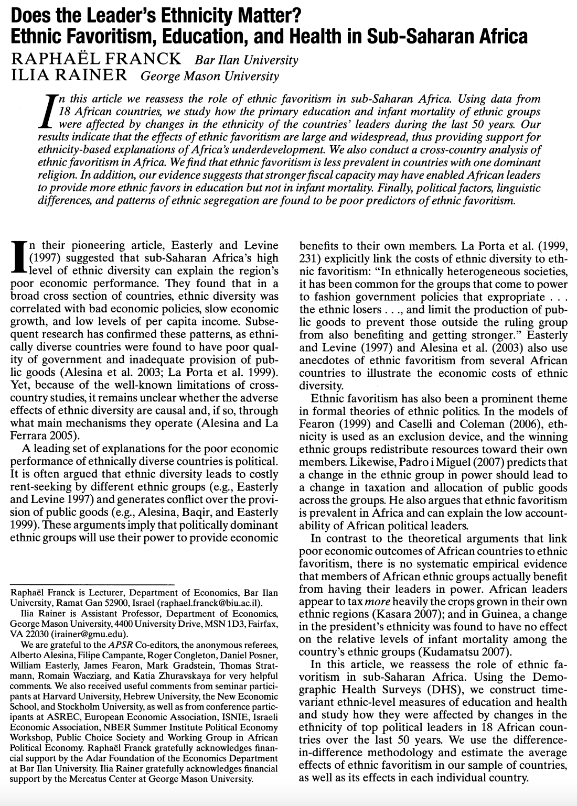

class: center middle
```{r setup, include=FALSE}
options(htmltools.dir.version = FALSE, servr.interval = 1, width = 115)
knitr::opts_chunk$set(collapse = TRUE, message = FALSE, warning = FALSE)
library(RefManageR)
library(tidyverse) # Just check it out: www.tidyverse.org
library(dagitty) # Use the dagitty package
library(ggdag) # Neat visualization of DAGs

options(htmltools.dir.version = FALSE, servr.interval = 0.5, width = 115, digits = 2)
knitr::opts_chunk$set(
  collapse = TRUE, message = FALSE, fig.retina = 3,
  warning = FALSE, cache = FALSE, fig.align='center',
  comment = "#", strip.white = TRUE)

BibOptions(check.entries = FALSE, 
           bib.style = "authoryear", 
           style = "markdown",
           hyperlink = FALSE,
           no.print.fields = c("doi", "url", "ISSN", "urldate", "language", "note", "isbn", "volume"))
myBib <- ReadBib("./../../../Adv-WIM.bib", check = FALSE)

xaringanExtra::use_xaringan_extra(c("tile_view", "tachyons"))
xaringanExtra::use_panelset()
```
class: left clear
# General lessons .font70[I want to see you making an argument]

- TEXTFLOW! Texts are not chains of bullet points.

- The application and comparison are crucial. Here you show your skill as a sociologist.
  + You explanation needs to be linked not only to the outcome (e.g. wage), but also to the disadvantaged group (e.g. women)
  + Don't just repeat the theories, consider their implications for the phenomenon. 

- Focus on that part of a theory, which matters for your phenomenon.
  + "A study by Bird and Smith uses an example of a “collective action problem,” which can appear when members of a particular group have different interests and there may be conflict over who will pay the price for group-level signalling (Bird & Smith 2005: 235)."
  
---
class: left
# General lessons .font70[Be deligent with your text]

- Give factual evidence of the empirical extent of the phenomenon. 
  + How big is the gender wage gap? What are the chances to make it to the top if your parents were poor?
  
- You need to cite, if you make a factual claim about how the world works - unless you say: "I claim that ..."
  + "Social mobility is linked to inequality in the way that societies with high social inequality also have a rate of low social mobility."

- Chicago your paragraphs:
  + One idea one paragraph. Core idea is the first sentence. The rest of the paragraph elaborates the idea (argument, evidence, etc.)
  
- Theories are arguments, they don't show anything factual about the world.

---

```{r, echo = FALSE, out.width='40%'}

```
