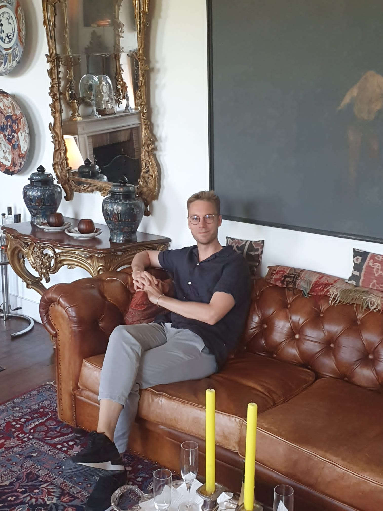
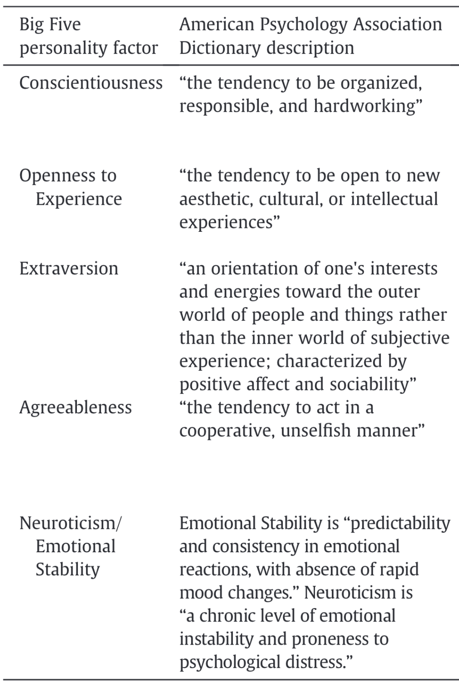
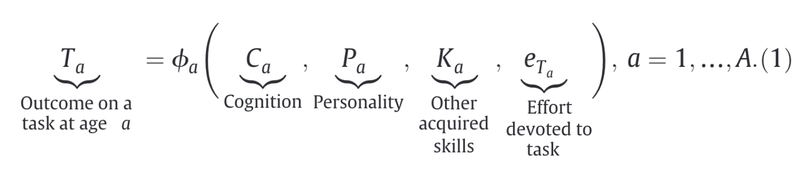
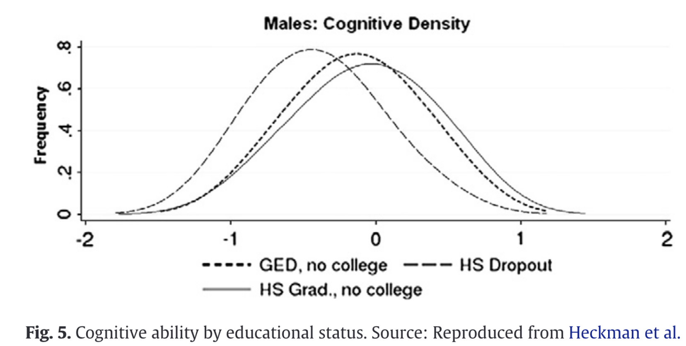
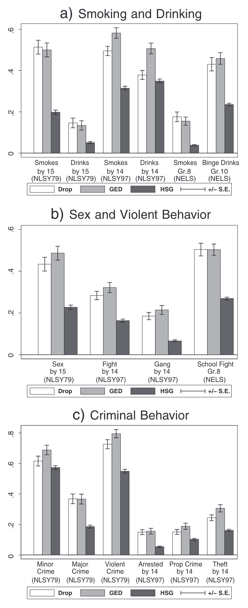

```{r setup, include = FALSE}
library(RefManageR)
library(knitr)

options(htmltools.dir.version = FALSE, servr.interval = 0.5, width = 115, digits = 3)
knitr::opts_chunk$set(
  collapse = TRUE, message = FALSE, fig.retina = 3, error = TRUE,
  warning = FALSE, cache = FALSE, fig.align = 'center',
  comment = "#", strip.white = TRUE, tidy = FALSE)

BibOptions(check.entries = FALSE, 
           bib.style = "authoryear", 
           style = "markdown",
           hyperlink = FALSE,
           no.print.fields = c("doi", "url", "ISSN", "urldate", "language", "note", "isbn", "volume"))
myBib <- ReadBib("./../../../Adv-WIM.bib", check = FALSE)

xaringanExtra::use_xaringan_extra(c("tile_view", "tachyons"))
xaringanExtra::use_panelset()
```
class: middle clear

.push-left[
```{r, echo = FALSE, out.width='80%'}
knitr::include_graphics('https://c.tenor.com/6Ju_FlRfSGUAAAAC/tkt-smart.gif')
```
]

.push-right[
```{r, echo = FALSE, out.width='80%'}
knitr::include_graphics('https://i.dailymail.co.uk/i/pix/2015/09/18/17/042FBE210000044D-0-image-a-4_1442594021038.jpg')
```
]


---
# 3 fundamental guises of capital

.left-column[
> Capital is accumulated labor [...]

> -- `r Citet(myBib, "bourdieu_forms_1986", after = " p. 15")`

- Capitals can be converted, but only with loss and effort (time).

- Capitals vary in how much they can be concealed.

- $+$ concealment <br> $\rightarrow$ - transmission.
]

.right-column[
```{tikz, DAG1,  echo = FALSE, out.width='80%'}
\usetikzlibrary{shapes,decorations,arrows,calc,arrows.meta,fit,positioning}
\tikzset{
    -Latex,auto,node distance =1 cm and 1 cm,semithick,
    state/.style ={ellipse, draw, minimum width = 0.7 cm},
    point/.style = {circle, draw, inner sep=0.04cm,fill,node contents={}},
    bidirected/.style={Latex-Latex,dashed},
    el/.style = {inner sep=2pt, align=left, sloped}
}

\begin{tikzpicture}
\sffamily
    \node[state] (1) at (0,0) {Labor};
    \node[state] (2) [right = of 1] {Cultural capital};
    \node[state] (3) [above = of 2] {Economic capital};
    \node[state] (4) [below = of 2] {Social capital};

    \path (1) edge  (2);
    \path (1) edge  (3);
    \path (1) edge  (4);
    \path[bidirected] (2) edge[gray] (3);
    \path[bidirected] (3) edge[gray, out=330, in=35] (4);
    \path[bidirected] (2) edge[gray] (4);
\end{tikzpicture}
```
]

---
# Comparison to Grusky's list

.push-left[
```{r, echo = FALSE, out.width='80%'}
knitr::include_graphics('../1-Intro/img/Grusky1.png')
```
.center[.backgrnote[*Source*: `r Citet(myBib, "grusky_stories_2018")`]]
]

.push-right[
```{tikz, ref.label = "DAG1",  echo = FALSE, out.width='80%'}
```

.content-box-green[
The `r Citet(myBib, "grusky_stories_2018")` list is exemplary. `r Citet(myBib, "bourdieu_forms_1986")` claims to be comprehensive. Which points of Grusky's list can be subsumed into Bourdieu's model? Which ones are missing?
]]


---
# 3 types of cultural capital

.push-left[
```{r, echo = FALSE, out.width='70%'}

```
]

.push-right[
<br>
<br>

1. **Embodied** "dispositions of the mind and body".
  + Disguised as legitimate competence.
  + Hidden transmission within families.

2. **Objectified** "cultural goods".
  + Need material and symbolic appropriation.

3. **Institutionalized** "educational qualifications".
  + Institutional recognition.
  + Intransmittable.
]

---
layout: true
class: clear
# (Soft) Skills, intelligence, and knowledge

.left-column[
> Soft skills predict success in life, [...] they causally produce that success [...]

> -- `r Citet(myBib, "heckman_hard_2012", after = ", p. 451")`

- **Intelligence**: Reasoning & rate at which a person learns.

- **Soft Skills**: Personality traits.

- **Knowledge** learned at school and through life experience.
]

---
.right-column[
```{tikz, DAG2,  echo = FALSE, out.width='100%'}
\usetikzlibrary{shapes,decorations,arrows,calc,arrows.meta,fit,positioning}
\tikzset{
    -Latex,auto,node distance =1 cm and 1 cm,semithick,
    state/.style ={ellipse, draw, minimum width = 0.7 cm},
    point/.style = {circle, draw, inner sep=0.04cm,fill,node contents={}},
    bidirected/.style={Latex-Latex,dashed},
    el/.style = {inner sep=2pt, align=left, sloped}
}

\begin{tikzpicture}
\sffamily
    \node[state] (1) at (0,0) {Genes};
    \node[state] (2) [below = of 1] {Investment};
    \node[state] (3) [right = of 1] {Intelligence};
    \node[state] (4) [right = of 2] {Soft skills};
    \node[state] (5) at (6, -0.75) {Knowledge};
    \node[state] (6) [right = of 5] {Success};

    \path (1) edge  (3);
    \path (1) edge  (4);
    \path (2) edge  (3);
    \path (2) edge  (4);
    \path (3) edge  (5);
    \path (4) edge  (5);
    \path (3) edge  (6);
    \path (4) edge  (6);
    \path (5) edge  (6);
    \path (5) edge[gray, out=200, in=35] (2);
\end{tikzpicture}
```
]

---

.push-right[
```{r, echo = FALSE, out.width='60%'}

```
.center[.backgrnote[*Source*: `r Citet(myBib, "heckman_hard_2012")`]]
]

---

.right-column[
```{tikz, ref.label = "DAG2",  echo = FALSE, out.width='100%'}
```

.content-box-green[
How does this compare to Bourdieu's three types of cultural capital? What's different, what's missing?
]]

---
layout: false
# Difficult measurement

.push-left[
> All cognitive and personality traits are measured using performance on "tasks",

> -- `r Citet(myBib, "heckman_hard_2012", after = " p. 452")`

```{r, echo = FALSE, out.width='100%'}

```

.content-box-green[
Why is this a challenge for research?
]
]

.push-right[
```{r, echo = FALSE, out.width='80%'}
knitr::include_graphics('https://www.newsclick.in/sites/default/files/styles/responsive_885/public/2022-08/Screenshot%20from%202022-08-22%2017-31-02.png?itok=7INsi3TO')
```

```{r, echo = FALSE, out.width='80%'}
knitr::include_graphics('https://upload.wikimedia.org/wikipedia/commons/thumb/e/ec/Raven_Matrix.svg/250px-Raven_Matrix.svg.png')
```
]

---
layout: true
# The evidence

.push-left[
```{r, echo = FALSE, out.width='100%'}

```
.center[.backgrnote[*Source*: `r Citet(myBib, "heckman_hard_2012")`]]
]

---
---

.push-right[
```{r, echo = FALSE, out.width='37%'}

```
.center[.backgrnote[*Source*: `r Citet(myBib, "heckman_hard_2012")`]]
]

---

.push-right[
```{r, echo = FALSE, out.width='34%'}
knitr::include_graphics('./img/Heckman5.png')
```
.center[.backgrnote[*Source*: `r Citet(myBib, "heckman_hard_2012")`]]
]

---
layout: false
# Group discussion

.push-left[
.content-box-green[
Taken as an inequality-generating mechanism, 

```{tikz, DAG3,  echo = FALSE, out.width='70%'}
\usetikzlibrary{shapes,decorations,arrows,calc,arrows.meta,fit,positioning}
\tikzset{
    -Latex,auto,node distance =1 cm and 1 cm,semithick,
    state/.style ={ellipse, draw, minimum width = 0.7 cm},
    point/.style = {circle, draw, inner sep=0.04cm,fill,node contents={}},
    bidirected/.style={Latex-Latex,dashed},
    el/.style = {inner sep=2pt, align=left, sloped}
}

\begin{tikzpicture}
\sffamily
    \node[state] (1) at (0,0) {Birth};
    \node[state] (2) [red, right = of 1] {$M$};
    \node[state] (3) [right = of 2] {Inequality at adulthood};

    \path (1) edge  (2);
    \path (2) edge  (3);
\end{tikzpicture}
```

how can `r Citet(myBib, "bourdieu_forms_1986")` / `r Citet(myBib, "heckman_hard_2012")` help us explain Topic 1-3?
]

<br>

|                    Social mobility | Gender wage gap | Power |
-------------------|---------|---------|---------|
Bourdieu           | Group 1 | Group 3 | Group 5 |
Heckman and Kautz  | Group 2 | Group 4 | Group 6 |
]

.push-right[
```{r, echo = FALSE, out.width='80%'}
knitr::include_graphics('https://www.educationworld.in/wp-content/uploads/2018/04/gd.jpg')
```
]

---
# References

.font80[
```{r ref, results = 'asis', echo = FALSE}
PrintBibliography(myBib)
```
]
