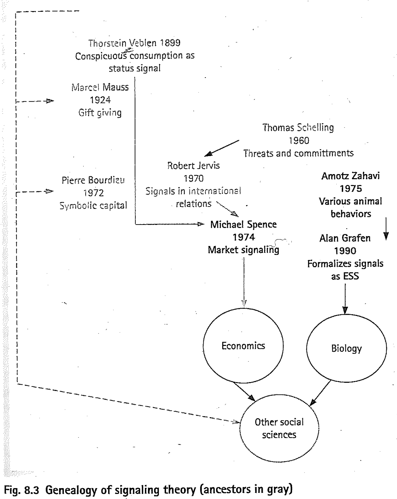
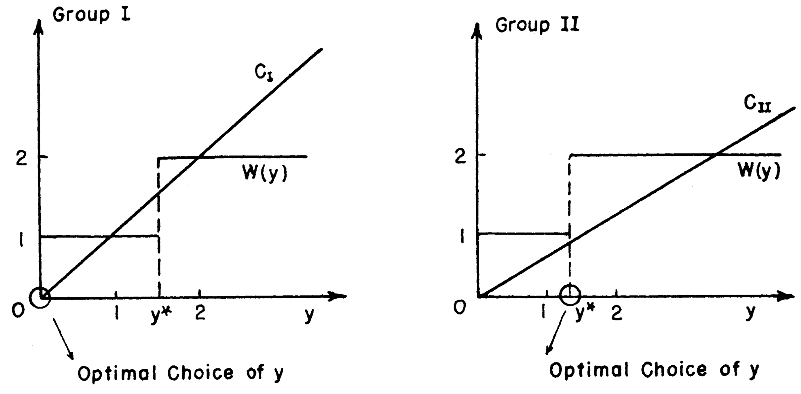

```{r setup, include = FALSE}
library(RefManageR)
library(knitr)

options(htmltools.dir.version = FALSE, servr.interval = 0.5, width = 115, digits = 3)
knitr::opts_chunk$set(
  collapse = TRUE, message = FALSE, fig.retina = 3, error = TRUE,
  warning = FALSE, cache = FALSE, fig.align = 'center',
  comment = "#", strip.white = TRUE, tidy = FALSE)

BibOptions(check.entries = FALSE, 
           bib.style = "authoryear", 
           style = "markdown",
           hyperlink = FALSE,
           no.print.fields = c("doi", "url", "ISSN", "urldate", "language", "note", "isbn", "volume"))
myBib <- ReadBib("./../../../Adv-WIM.bib", check = FALSE)

xaringanExtra::use_xaringan_extra(c("tile_view", "tachyons"))
xaringanExtra::use_panelset()
```
# Signals vs. signs.font60[/indices]

.push-left[
```{r, echo = FALSE, out.width='60%'}
knitr::include_graphics('https://www.kongehuset.dk/media/zqpbib2n/dronning_margrethe_2020_medum.jpg')
```
]

.push-right[
- **Sign**: Any perceptible property that modifies our belief about someone or something.


$$\downarrow$$

.center[Signaler takes action to display the sign.]

$$\downarrow$$

- **Signal**: Purposive communication.
]

---
# The problem .font60[.alert[Necessary element of signaling!]]

.push-left[
```{r, echo = FALSE, out.width='80%'}
knitr::include_graphics('https://ejendroem.dk/wp-content/uploads/2019/07/Ejendr%C3%B8m_15-1024x683.jpg')
```

```{r, echo = FALSE, out.width='80%'}
knitr::include_graphics('https://www.mrroof.com/wp-content/uploads/2020/02/mold-water-damage.jpg')
```
]

.push-right[
1. Mægler/**Signaler benefits**, if Køber/Receiver buys.

2. Køber/**Receiver only benefits, if** Mægler/**Signaler can be trusted** that the house has quality $k$ (no rot under the roof).

- If house has $k$, Mægler's and Køber's interest are aligned (both benefit). 

- If $\text{non-}k$, Køber may be deceived (only Mægler benefits).
]

---
# The solution: $b_{k} > s > b_{\text{non-}k}$

.push-left[
> *If* $s$ *is too costly to fake for all or most* $\text{non-}k$ *signalers then observing* $s$ *is good evidence that the signaler has* $k$.

> [...]

> The higher the proportion of $\text{non-}k$ signalers who use this signal the less conclusive is the evidence. 

> Signals that approach near perfection exist but are rare.

> -- `r Citet(myBib, "gambetta_signalling_2009", after = ", page 173ff.")`

.backgrnote[
$b = \text{Benefit}$

$k = \text{Property desired by Receiver}$

$s = \text{Cost of faking signal}$
]
]

.push-right[
```{r, echo = FALSE, out.width='80%'}
knitr::include_graphics('https://img.gifglobe.com/grabs/montypython/MontyPythonsLifeOfBrian/gif/7wAXSbinjXvQ.gif')
```
.center[
Non-working signal: $b_{k} > s < b_{\text{non-}k}$
]]

---
# 4 Sources of signal cost

.push-left[
- Receiver independent: 'Wasting',

- Receiver dependent: Exposure to risk,

- Third party-dependent cost,

- Costless signals.
  > To identify German spies British interrogators asked the results of famous cricket matches, the knowledge of which was costless to acquire for a genuine British [...]
  
  > -- `r Citet(myBib, "gambetta_signalling_2009", after = ", page 182")`
]

.push-right[
```{r, echo = FALSE, out.width='60%'}
knitr::include_graphics('https://thestyleup.com/wp-content/uploads/2015/09/mora-gang.jpg')
```
]

---
# Origin

.push-left[
```{r, echo = FALSE, out.width='70%'}

```
.center[.backgrnote[*Source*: `r Citet(myBib, "gambetta_signalling_2009")`]]
]

.push-right[
```{r, echo = FALSE, out.width='100%'}
knitr::include_graphics('https://www.amlu.com/wp-content/uploads/2022/03/a-look-russian-billionaire-andrey-melnichenkos-sailing-yacht-a-55.jpg')
```
]

---
# As a scientific program

.left-column[
```{r, echo = FALSE, out.width='90%'}
knitr::include_graphics('../2-Skills-and-Resources/img/Paris.JPG')
```
]

.right-column[
```{tikz, DAG1,  echo = FALSE, out.width='100%', cache = TRUE}
\usetikzlibrary{shapes,decorations,arrows,calc,arrows.meta,fit,positioning}
\tikzset{
    -Latex,auto,node distance =1 cm and 1 cm,semithick,
    state/.style ={ellipse, draw, minimum width = 0.7 cm},
    point/.style = {circle, draw, inner sep=0.04cm,fill,node contents={}},
    bidirected/.style={Latex-Latex,dashed},
    el/.style = {inner sep=2pt, align=left, sloped}
}

\begin{tikzpicture}
\sffamily
    \node[state] (1) at (0,0) {Skills \& Resources of $i$};
    \node[state] (2) [red, right = of 1] {Signaling of $i$};
    \node[state] (3) [red, above = of 2] {Receiver $j$ responds};
    \node[state] (4) [red, below = of 2] {Signaling cost for $i$};
    \node[state] (5) [right = of 2] {Benefit for $i$};

    \path (1) edge  (4);
    \path (3) edge  (5);
    \path (4) edge  (2);
    \path (2) edge  (3);
\end{tikzpicture}
```
]

---
# Implications for our view education

.right-column[
```{r, echo = FALSE, out.width='100%'}

```

> [...] a signal will not effectively distinguish one aplpicant from another, unless the costs of signalling are negatively correlated with productive capacity.

> `r Citet(myBib, "spence_job_1973", after = ", p. 358")`
]

--

.left-column[
- Is education a signal or "absolute" skill/knowledge?
  1. *Signals are relative* $\rightarrow$ weak if many display it. *Knowledge is absolute* $\rightarrow$ stays true, even if many others possess it.
  
  2. *Signal strength* may vary across groups (gender, race, class).
]

---
# Implications for our view education

.right-column[
<iframe src="https://ourworldindata.org/grapher/share-of-the-population-with-completed-tertiary-education?time=2010" loading="lazy" style="width: 100%; height: 500px; border: 0px none;"></iframe>
]

.left-column[
- Is education a signal or "absolute" skill/knowledge?
  1. *Signals are relative* $\rightarrow$ weak if many display it. *Knowledge is absolute* $\rightarrow$ stays true, even if many others possess it.
  
  2. *Signal strength* may vary across groups (gender, race, class).
]

---
# Group discussion

.push-left[
.content-box-green[
Taken as an inequality-generating mechanism, 

```{tikz, ref.label = "DAG1",  echo = FALSE, out.width='70%'}
```

how can signaling help us explain Topic 1-2?
]

<br>

|                          Power | Ethnic wage gap |
-------------------------|---------|---------|
'Wasting' signs/signals  | Group 1 | Group 5 |
Costless signs/signals   | Group 2 | Group 6 |
Receivers                | Group 3 | Group 7 |
Varying signal strength  | Group 4 | Group 8 |

]

.push-right[
```{r, echo = FALSE, out.width='80%'}
knitr::include_graphics('https://www.educationworld.in/wp-content/uploads/2018/04/gd.jpg')
```
]

---
# References

.font80[
```{r ref, results = 'asis', echo = FALSE}
PrintBibliography(myBib)
```
]
