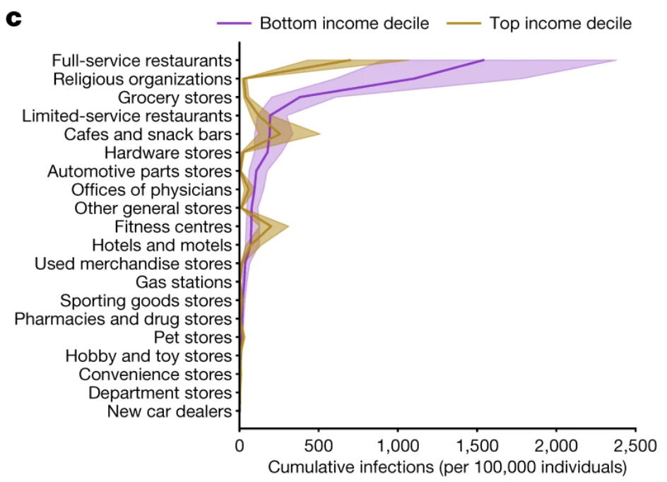
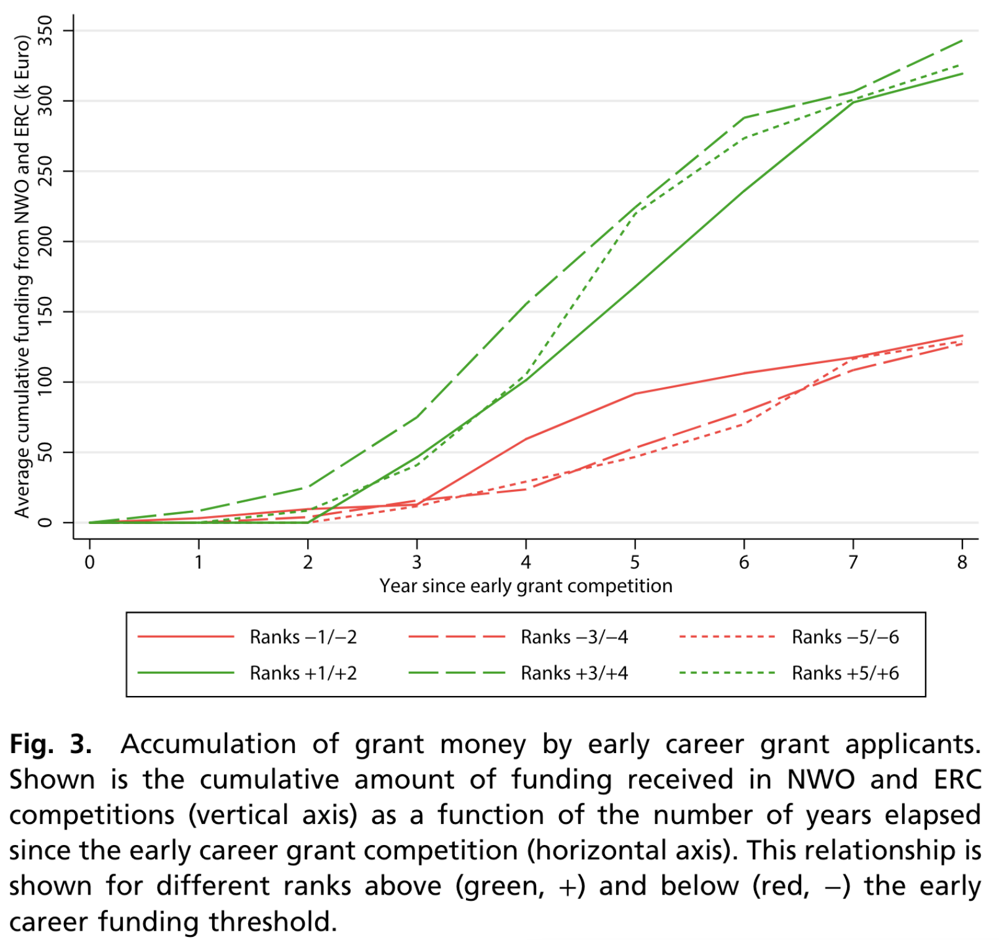
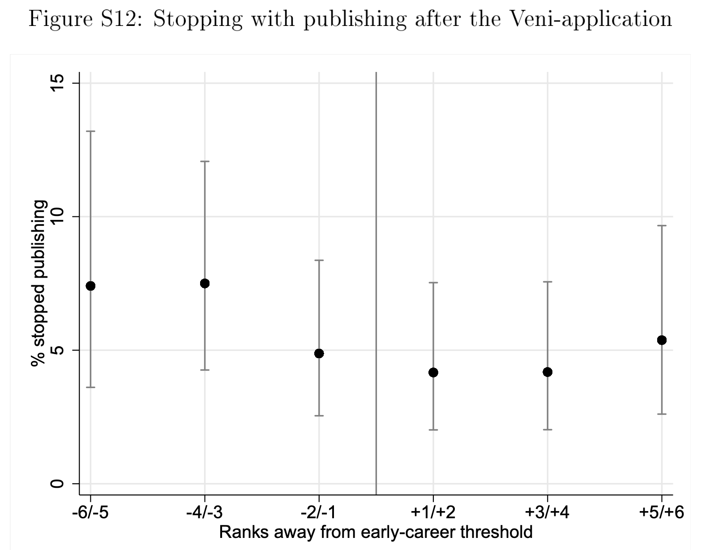

```{r setup, include = FALSE}
library(RefManageR)
library(knitr)

options(htmltools.dir.version = FALSE, servr.interval = 0.5, width = 115, digits = 3)
knitr::opts_chunk$set(
  collapse = TRUE, message = FALSE, fig.retina = 3, error = TRUE,
  warning = FALSE, cache = FALSE, fig.align = 'center',
  comment = "#", strip.white = TRUE, tidy = FALSE)

BibOptions(check.entries = FALSE, 
           bib.style = "authoryear", 
           style = "markdown",
           hyperlink = FALSE,
           no.print.fields = c("doi", "url", "ISSN", "urldate", "language", "note", "isbn", "volume"))
myBib <- ReadBib("./../../../Adv-WIM.bib", check = FALSE)

xaringanExtra::use_xaringan_extra(c("tile_view", "tachyons"))
xaringanExtra::use_panelset()
```
# Power law

```{r, echo = FALSE, out.width='60%'}
knitr::include_graphics('https://upload.wikimedia.org/wikipedia/commons/thumb/8/8a/Long_tail.svg/600px-Long_tail.svg.png')
```
.center[.backgrnote[*Source*: [Wikipedia](https://en.wikipedia.org/wiki/Power_law)]]

---
layout: true
# Cumulative Advantage

.left-column[

$$Y_{it} = Y_{i0}e^{\color{red}{\gamma} t}$$

1. Growth of $Y_{it}$ depends on itself.
2. Small early advantages grow larger over time.
3. If growth rate depends on status (gender, race, ...), status inequality growths over time.
4. Inequality growths over time.

<br>

.font70[
$$Y_{it} = 5*3^{1* t}$$

$$\color{blue}{Y_{it} = 5*3^{1.1* t}}$$
$$\color{red}{Y_{it} = 10*3^{1* t}}$$
]]

---

.right-column[
```{r fig1, echo = FALSE, out.width='90%', fig.height = 4, fig.width = 5, results= FALSE}
library(ggplot2)
ggplot() +
  xlim(0, 2) +
  geom_function(fun = function(t) 5*3^t) +
  geom_function(fun = function(t) 5*3^(1.1*t), color = "blue") +
  geom_function(fun = function(t) 10*3^t, color = "red") + 
  theme_minimal() +
  scale_y_continuous(breaks = c(5, 10, 15, 16.7, 30, 45, 56.1, 90)) +
  # scale_x_continuous(breaks = c(0, 1, 2, 3)) +
  labs(x = "time", y = "Outcome")
```
]

---

.right-column[
$$Y_{it} = Y_{i0}e^{\color{red}{\gamma} t}$$

```{r, echo = FALSE, out.width='60%'}

```
.center[.backgrnote[*Source*: `r Citet(myBib, "chang_mobility_2021")`]]
]

---
layout: false
# Simple CA

.left-column[
$$Y_{it} = 5*3^{1* t}$$

$$\color{blue}{Y_{it} = (5*3^{1* t})+5}$$
]

.right-column[
$$\text{ln}(Y_{it}) = \color{red}{\gamma_{1}z_{it} + \gamma_{2}z_{it}^2} + \beta'X_{it} +\epsilon_{it}$$
```{r fig2, echo = FALSE, out.width='70%', fig.height = 4, fig.width = 5, results= FALSE}
library(ggplot2)
ggplot() +
  xlim(0, 2) +
  geom_function(fun = function(t) 5*3^t) +
  geom_function(fun = function(t) 5*(3^t) + 5, color = "blue") +
  theme_minimal() +
  scale_y_continuous(breaks = c(5, 10, 45, 50)) +
  # scale_x_continuous(breaks = c(0, 1, 2, 3)) +
  labs(x = "Work experience", y = "Outcome")
```
]

---
# Path-dependent CA
.left-column[
$$Y_{it} = 5*3^{1* t}$$

$$\color{blue}{Y_{it} = (5+5)*3^{1* t})}$$
]

.right-column[
$$Y_{it} = \color{red}{(1 + \gamma)Y_{i,t-1}} + \beta'X_{it} +\epsilon_{it}$$
```{r fig3, echo = FALSE, out.width='70%', fig.height = 4, fig.width = 5, results= FALSE}
library(ggplot2)
ggplot() +
  xlim(0, 2) +
  geom_function(fun = function(t) 5*3^t) +
  geom_function(fun = function(t) 10*(3^t), color = "blue") +
  theme_minimal() +
  scale_y_continuous(breaks = c(5, 10, 45, 90)) +
  # scale_x_continuous(breaks = c(0, 1, 2, 3)) +
  labs(x = "Outcome, t-1", y = "Outcome")
```
]

---
class: inverse middle center
# 4 Mechanisms <br> of Path-dependent cumulative advantage

---
# 1 Signal mechanism

.left-column[
```{r, echo = FALSE, out.width='60%'}
knitr::include_graphics('https://upload.wikimedia.org/wikipedia/en/0/08/Robert_K_Merton.jpg')
```
.center[.backgrnote[[Robert K. Merton](https://en.wikipedia.org/wiki/Robert_K._Merton)]]
]


.right-column[
```{tikz, DAG1,  echo = FALSE, out.width='100%', cache = TRUE}
\usetikzlibrary{shapes,decorations,arrows,calc,arrows.meta,fit,positioning}
\tikzset{
    -Latex,auto,node distance =1 cm and 1 cm,semithick,
    state/.style ={ellipse, draw, minimum width = 0.7 cm},
    point/.style = {circle, draw, inner sep=0.04cm,fill,node contents={}},
    bidirected/.style={Latex-Latex,dashed},
    el/.style = {inner sep=2pt, align=left, sloped}
}

\begin{tikzpicture}
\sffamily
    \node[state] (1) at (0,0) {$\text{Success}_{t=0}$};
    \node[state] (2) [red, right = of 1] {Signal of ability};
    \node[state] (3) [red, right = of 2] {Resources};
    \node[state] (4) [right = of 3] {$\text{Success}_{t=1}$};

    \path (1) edge  (2);
    \path (2) edge  (3);
    \path (3) edge  (4);
\end{tikzpicture}
```

```{r, echo = FALSE, out.width='55%'}

```
.center[.backgrnote[*Source*: `r Citet(myBib, "bol_matthew_2018")`]]
]

---
# 2 Tournament mechanism

```{tikz, DAG2,  echo = FALSE, out.width='100%', cache = TRUE}
\usetikzlibrary{shapes,decorations,arrows,calc,arrows.meta,fit,positioning}
\tikzset{
    -Latex,auto,node distance =1 cm and 1 cm,semithick,
    state/.style ={ellipse, draw, minimum width = 0.7 cm},
    point/.style = {circle, draw, inner sep=0.04cm,fill,node contents={}},
    bidirected/.style={Latex-Latex,dashed},
    el/.style = {inner sep=2pt, align=left, sloped}
}

\begin{tikzpicture}
\sffamily
    \node[state] (1) at (0,0) {$\text{Success at tournament}_{t=0}$};
    \node[state] (2) [red, right = of 1] {Resources};
    \node[state] (3) [right = of 2] {$\text{Success (at tournament)}_{t=1}$};

    \path (1) edge  (2);
    \path (2) edge  (3);
\end{tikzpicture}
```

.left-column[

```{r, echo = FALSE, out.width='100%'}
knitr::include_graphics('https://pbs.twimg.com/media/FGFLD2yXwAAJdKL?format=jpg&name=small')
```
]

--

.right-column[
```{r, echo = FALSE, out.width='100%'}
knitr::include_graphics('https://f1bythenumbers.com/storage/2021/12/gp22_race_top_10.svg')
```
]

---
# 3 Motivation mechanism

```{tikz, DAG3,  echo = FALSE, out.width='70%', cache = TRUE}
\usetikzlibrary{shapes,decorations,arrows,calc,arrows.meta,fit,positioning}
\tikzset{
    -Latex,auto,node distance =1 cm and 1 cm,semithick,
    state/.style ={ellipse, draw, minimum width = 0.7 cm},
    point/.style = {circle, draw, inner sep=0.04cm,fill,node contents={}},
    bidirected/.style={Latex-Latex,dashed},
    el/.style = {inner sep=2pt, align=left, sloped}
}

\begin{tikzpicture}
\sffamily
    \node[state] (1) at (0,0) {$\text{Success}_{t=0}$};
    \node[state] (2) [red, right = of 1] {Motivation};
    \node[state] (3) [right = of 2] {$\text{Success}_{t=1}$};

    \path (1) edge  (2);
    \path (2) edge  (3);
\end{tikzpicture}
```

```{r, echo = FALSE, out.width='45%'}

```
.center[.backgrnote[*Source*: `r Citet(myBib, "bol_matthew_2018")`]]

---
# 4 Selection mechanism

```{tikz, DAG4,  echo = FALSE, out.width='70%', cache = TRUE}
\usetikzlibrary{shapes,decorations,arrows,calc,arrows.meta,fit,positioning}
\tikzset{
    -Latex,auto,node distance =1 cm and 1 cm,semithick,
    state/.style ={ellipse, draw, minimum width = 0.7 cm},
    point/.style = {circle, draw, inner sep=0.04cm,fill,node contents={}},
    bidirected/.style={Latex-Latex,dashed},
    el/.style = {inner sep=2pt, align=left, sloped}
}

\begin{tikzpicture}
\sffamily
    \node[state] (1) at (0,0) {$\text{Success}_{t=0}$};
    \node[state] (2) [red, right = of 1] {More supportive environment};
    \node[state] (3) [right = of 2] {$\text{Success}_{t=1}$};

    \path (1) edge  (2);
    \path (2) edge  (3);
\end{tikzpicture}
```

<iframe src='https://www.hannohilbig.com/' width='1400' height='450' frameborder='0' scrolling='yes'></iframe>

---
# Group discussion

.push-left[
.content-box-green[
Taken as an inequality-generating mechanism, 
how can signaling help us explain Topic 1-2?
]

<br>

|                          Social mobility | Gender wage gap |
-------------------------|---------|---------|
Signal-resource mechanism  | Group 1 | Group 4 |
Tournament mechanism   | Group 2 | Group 5 |
Supportive environment                | Group 3 | Group 6 |

]

.push-right[
```{r, echo = FALSE, out.width='80%'}
knitr::include_graphics('https://www.educationworld.in/wp-content/uploads/2018/04/gd.jpg')
```
]

---
# References

.font80[
```{r ref, results = 'asis', echo = FALSE}
PrintBibliography(myBib)
```
]
