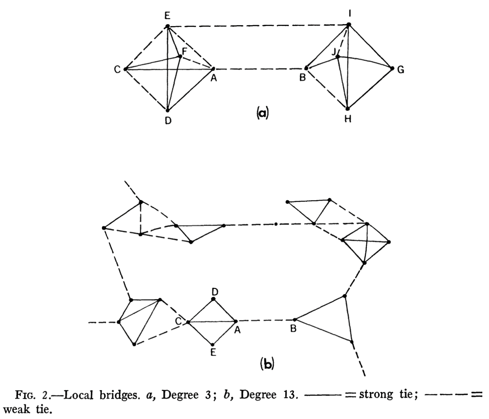
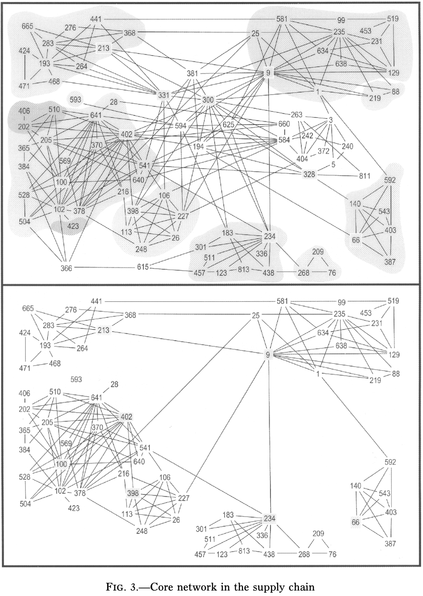
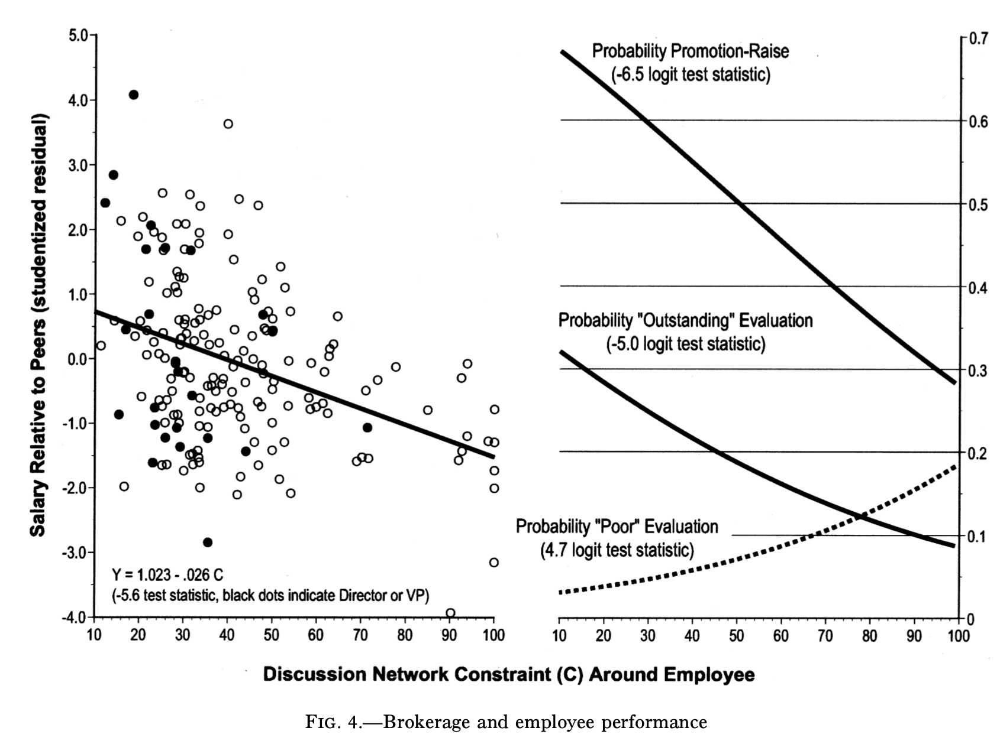
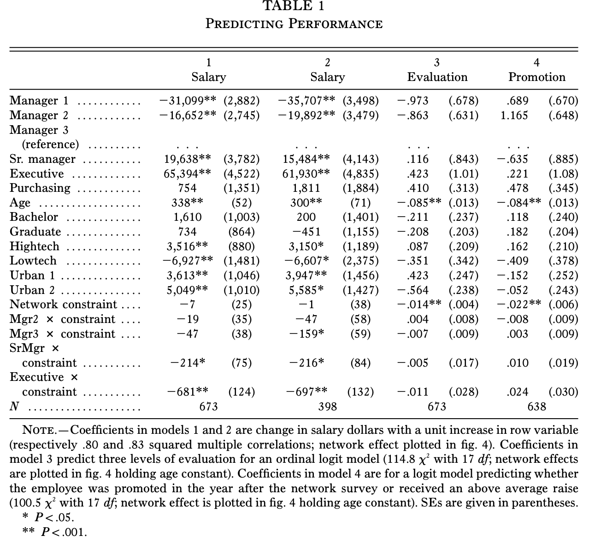
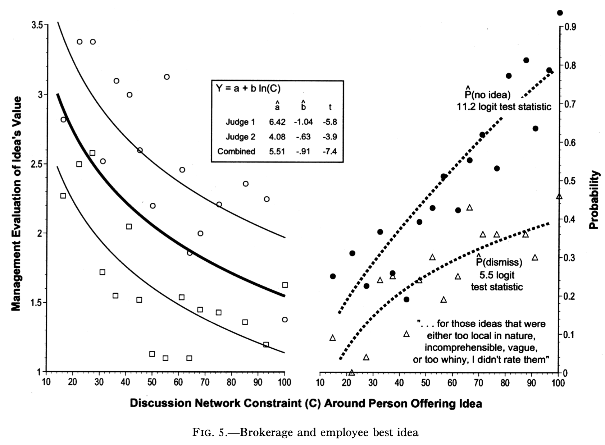
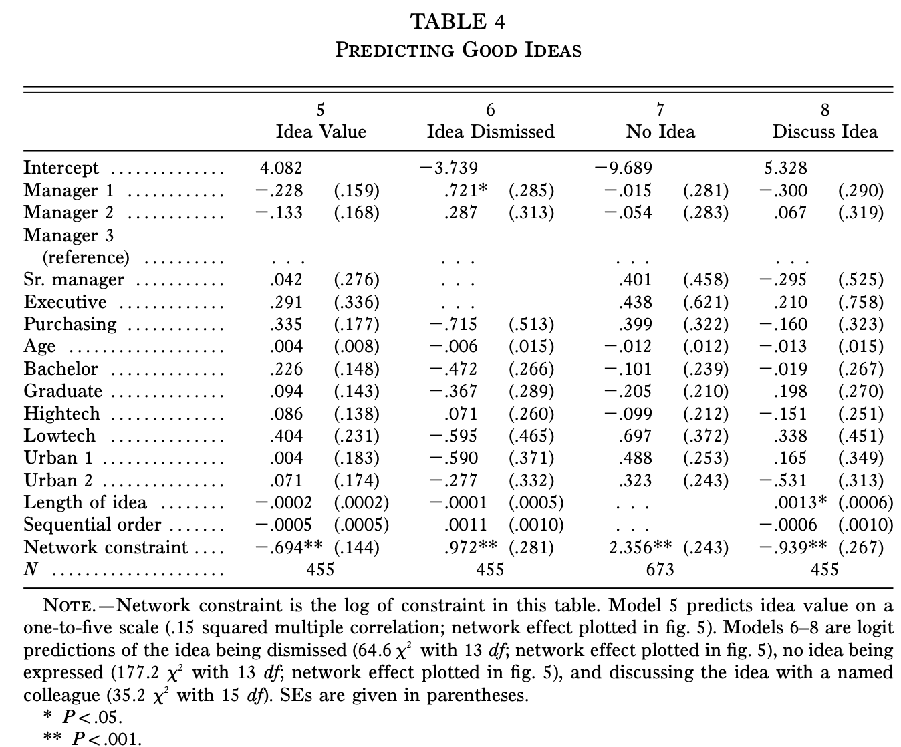

```{r setup, include = FALSE}
library(RefManageR)
library(knitr)

options(htmltools.dir.version = FALSE, servr.interval = 0.5, width = 115, digits = 3)
knitr::opts_chunk$set(
  collapse = TRUE, message = FALSE, fig.retina = 3, error = TRUE,
  warning = FALSE, cache = FALSE, fig.align = 'center',
  comment = "#", strip.white = TRUE, tidy = FALSE)

BibOptions(check.entries = FALSE, 
           bib.style = "authoryear", 
           style = "markdown",
           hyperlink = FALSE,
           no.print.fields = c("doi", "url", "ISSN", "urldate", "language", "note", "isbn", "volume"))
myBib <- ReadBib("./../../../Adv-WIM.bib", check = FALSE)

xaringanExtra::use_xaringan_extra(c("tile_view", "tachyons"))
xaringanExtra::use_panelset()
```
layout: true
# Weak ties

.push-right[
```{r, echo = FALSE, out.width='100%'}

```
.center[.backgrnote[*Source*: `r Citet(myBib, "granovetter_strength_1973")`]]
]

---

.push-left[
> the strength of a tie is a (probably linear) combination of the amount of time, the emotional intensity, the intimacy (mutual fonfiding), and the reciprocal services which characterize the tie.

> [...]

> the stronger the tie between A and B, the larger the proportion of individuals in S to whom they will *both* be tied, that is, connected by a weak or strong tie.

> `r Citet(myBib, "granovetter_strength_1973", after = ", p. 1361ff.")`
]

---

.push-left[
> the strength of a tie is a (probably linear) combination of the amount of time, the emotional intensity, the intimacy (mutual fonfiding), and the reciprocal services which characterize the tie.

> [...]

> the stronger the tie between A and B, the larger the proportion of individuals in S to whom they will *both* be tied, that is, connected by a weak or strong tie.

> `r Citet(myBib, "granovetter_strength_1973", after = ", p. 1361ff.")`

.content-box-green[
Why does this imply benefits of weak ties?]]
---
layout: false
# Benefits of weak ties


```{r, echo = FALSE, out.width='45%'}
knitr::include_graphics('https://upload.wikimedia.org/wikipedia/commons/thumb/f/f1/Tie-network.jpg/800px-Tie-network.jpg')
```


.push-left[
1. Weak ties diffuse more novel information.
2. Weak ties diffuse more unusual (less social pressure) information.
3. Weak ties diffuse information farther.
4. Weak ties integrate communities.
]

.push-right[
> weak ties, often denounced as generative of alienatio (Wirth 1938) are here seen as indispensible to individuals' opportunities and to their integration into communities; strong ties, breeding local cohesion, lead to overall fragmentation.

> `r Citet(myBib, "granovetter_strength_1973", after = ", p. 1378")`
]

---
# Brokerage and structural holes
.left-column[
> The hypothesis in this article is that people who stand near the holes in a social structure are at higher risk of having good ideas.

> `r Citet(myBib, "burt_structural_2004", after = ", p. 349")`

<br>
.content-box-green[
Why?]]

.right-column[
```{r, echo = FALSE, out.width='100%'}
knitr::include_graphics('https://d3i71xaburhd42.cloudfront.net/f94fd3326a9bc7896d6606fa23a658c32cfc75c8/28-Figure1-1.png')
```
.center[.backgrnote[*Source*: `r Citet(myBib, "burt_structural_2004")`]]
]

---
# Brokerage and structural holes
.push-left[
> The hypothesis in this article is that people who stand near the holes in a social structure are at higher risk of having good ideas.

> `r Citet(myBib, "burt_structural_2004", after = ", p. 349")`


.content-box-blue[
1. Enable information flow between groups.

2. Help copy strategies from other groups.

3. Foster strategic behavior of own group.

4. Synthesize.]]

.push-right[
```{r, echo = FALSE, out.width='100%'}
knitr::include_graphics('https://d3i71xaburhd42.cloudfront.net/f94fd3326a9bc7896d6606fa23a658c32cfc75c8/28-Figure1-1.png')
```
.center[.backgrnote[*Source*: `r Citet(myBib, "burt_structural_2004")`]]
]

---
# The case

.push-left[
.content-box-green[
In this company 9and probably any company), where do opportunities for brokerage arise from?
]]

.push-right[
```{r, echo = FALSE, out.width='65%'}

```
.center[.backgrnote[*Source*: `r Citet(myBib, "burt_structural_2004")`]]
]

---
# Evidence

.push-left[
```{r, echo = FALSE, out.width='100%'}

```
]

.push-right[
```{r, echo = FALSE, out.width='100%'}

```
.center[.backgrnote[*Source*: `r Citet(myBib, "burt_structural_2004")`]]
]

---
# Evidence

.push-left[
```{r, echo = FALSE, out.width='100%'}

```
]

.push-right[
```{r, echo = FALSE, out.width='100%'}

```
.center[.backgrnote[*Source*: `r Citet(myBib, "burt_structural_2004")`]]
]

---
# Social capital 1

.left-column[.content-box-red[
Key idea: Certain positions in a social network (a sociogram) and kinds of social ties are beneficial for access to information and oppportunities.    
]]

.right-column[
```{r, echo = FALSE, out.width='55%'}
knitr::include_graphics('https://upload.wikimedia.org/wikipedia/commons/thumb/f/f1/Tie-network.jpg/800px-Tie-network.jpg')
```

```{r, echo = FALSE, out.width='55%'}
knitr::include_graphics('https://d3i71xaburhd42.cloudfront.net/f94fd3326a9bc7896d6606fa23a658c32cfc75c8/28-Figure1-1.png')
```
]
---
# Group discussion

.push-left[
.content-box-green[
Taken as an inequality-generating mechanism, 
how can signaling help us explain Topic 1-2?
]

<br>

|                          Power | Ethnic wage gap | Education |
-------------------------|---------|---------|--------|
Weak ties  | Group 1 | Group 3 | Group 5 | 
Brokerage   | Group 2 | Group 4 | Group 6|


]

.push-right[
```{r, echo = FALSE, out.width='80%'}
knitr::include_graphics('https://www.educationworld.in/wp-content/uploads/2018/04/gd.jpg')
```
]

---
# References

.font80[
```{r ref, results = 'asis', echo = FALSE}
PrintBibliography(myBib)
```
]
