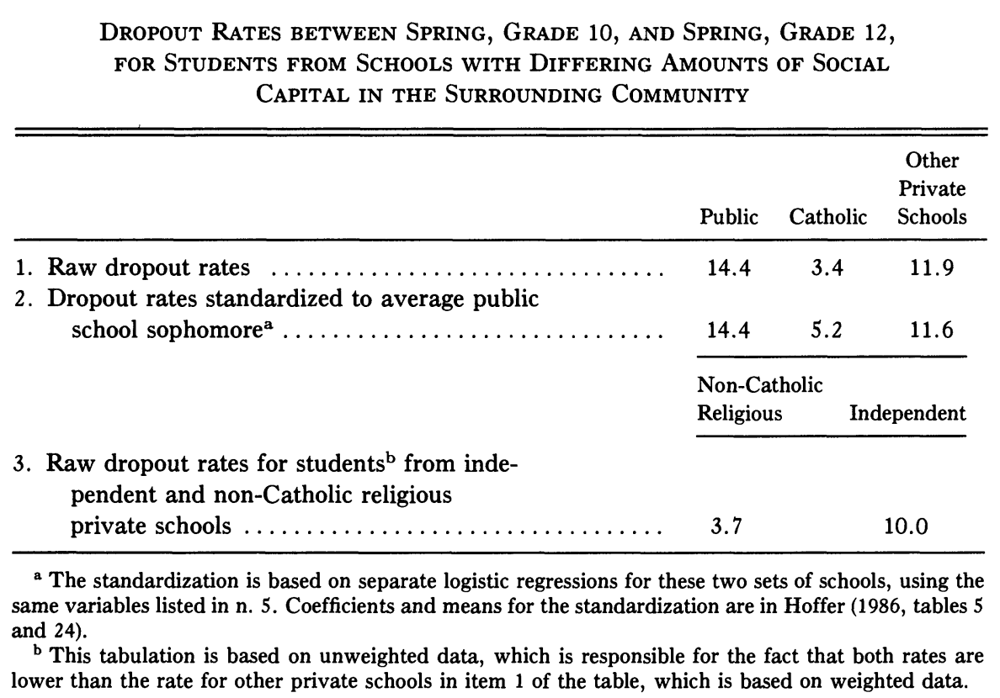

```{r setup, include = FALSE}
library(RefManageR)
library(knitr)

options(htmltools.dir.version = FALSE, servr.interval = 0.5, width = 115, digits = 3)
knitr::opts_chunk$set(
  collapse = TRUE, message = FALSE, fig.retina = 3, error = TRUE,
  warning = FALSE, cache = FALSE, fig.align = 'center',
  comment = "#", strip.white = TRUE, tidy = FALSE)

BibOptions(check.entries = FALSE, 
           bib.style = "authoryear", 
           style = "markdown",
           hyperlink = FALSE,
           no.print.fields = c("doi", "url", "ISSN", "urldate", "language", "note", "isbn", "volume"))
myBib <- ReadBib("./../../../Adv-WIM.bib", check = FALSE)

xaringanExtra::use_xaringan_extra(c("tile_view", "tachyons"))
xaringanExtra::use_panelset()
```
layout: true
# Closure

.left-column[
.content-box-green[
Why does Coleman see closed networks as beneficial?

Doesn't this contradict `r Citet(myBib, "granovetter_strength_1973")` and `r Citet(myBib, "burt_structural_2004")`]]

---

.right-column[
```{r, echo = FALSE, out.width='90%'}
knitr::include_graphics('https://www.researchgate.net/profile/Ann-Dale/publication/30934845/figure/fig1/AS:277092743827459@1443075466446/Networks-with-a-open-and-b-closed-structures-Source-Coleman-2000-p-27.png')
```
.center[.backgrnote[*Source*: `r Citet(myBib, "coleman_social_1988")`]]
]

---

.right-column[
```{r, echo = FALSE, out.width='90%'}
knitr::include_graphics('https://images.slideplayer.com/14/4344268/slides/slide_5.jpg')
```
]

---
layout: false
# Coleman's (collective) social capital

```{tikz, DAG1,  echo = FALSE, out.width='90%', cache = TRUE}
\usetikzlibrary{shapes,decorations,arrows,calc,arrows.meta,fit,positioning}
\tikzset{
    -Latex,auto,node distance =1 cm and 1 cm,semithick,
    state/.style ={ellipse, draw, minimum width = 0.7 cm},
    point/.style = {circle, draw, inner sep=0.04cm,fill,node contents={}},
    bidirected/.style={Latex-Latex,dashed},
    el/.style = {inner sep=2pt, align=left, sloped}
}

\begin{tikzpicture}
\sffamily
    \node[state] (1) at (0,1) {Closure};
    \node[state, align = center] (2) at (0,-1) {Multiplex \\ networks};
    \node[state, align = center] (3) at (3, 0) {Social \\ control};
    \node[state, align = center] (4) [right = of 3] {Trustworthiness \\ \& Norms};
    \node[state, align = center] (5) [right = of 4] {Lower \\ Transaction costs \\ \& Deviance};

    \path (1) edge  (3);
    \path (2) edge  (3);
    \path (3) edge  (4);
    \path (4) edge  (5);
\end{tikzpicture}
```

---
# Coleman's (collective) social capital

```{tikz, ref.label = "DAG1",  echo = FALSE, out.width='46%', cache = TRUE}
```

```{r, echo = FALSE, out.width='46%'}

```
.center[.backgrnote[*Source*: `r Citet(myBib, "coleman_social_1988")`]]

---
# Lin's social capital

```{r, echo = FALSE, out.width='60%'}
knitr::include_graphics('https://www.researchgate.net/profile/Iria-Puyosa/publication/30864378/figure/fig1/AS:652549241729025@1532591271844/Lins-Model-of-Social-Capital-Theory.png')
```
.center[.backgrnote[*Source*: `r Citet(myBib, "lin_building_2001")`]]

---
# Lin's social capital

.push-left[
```{r, echo = FALSE, out.width='100%'}
knitr::include_graphics('https://www.researchgate.net/profile/Iria-Puyosa/publication/30864378/figure/fig1/AS:652549241729025@1532591271844/Lins-Model-of-Social-Capital-Theory.png')
```
.center[.backgrnote[*Source*: `r Citet(myBib, "lin_building_2001")`]]
]

.push-right[
```{r, echo = FALSE, out.width='100%'}
knitr::include_graphics('https://www.researchgate.net/profile/Yaojun-Li-6/publication/267259242/figure/fig2/AS:361617163341825@1463227658163/An-example-of-the-Position-Generator-instrument-for-social-network-research.png')
```
]

---
# 3 types of social capital theories

 *Capital*             | *Facilitator*         | *Benefit*                  | *Asset*
-----------------------|-----------------------|----------------------------|--------
**Network location**   | Weak & bridiging ties | Information                | Individual
**Embedded resources** | Contacts status       | Resources of acquaintances | Individual
**Trust & Norms**      | Closed networks       |  social control            | Collective

---
layout: false
# Group discussion

.push-left[
.content-box-green[
Taken as inequality-generating mechanisms, 
how can Coleman's and Lin's social capital theories help us explain Topic 1-3?
]

<br>

Mechanism |  Power | Gender gap | Social mobility 
-------------------|---------|---------|--------
Coleman | Group 1 | Group 3 | Group 5 
Lin | Group 2 | Group 4 | Group 6


]

.push-right[
```{r, echo = FALSE, out.width='80%'}
knitr::include_graphics('https://www.educationworld.in/wp-content/uploads/2018/04/gd.jpg')
```
]

---
# References

.font80[
```{r ref, results = 'asis', echo = FALSE}
PrintBibliography(myBib)
```
]
