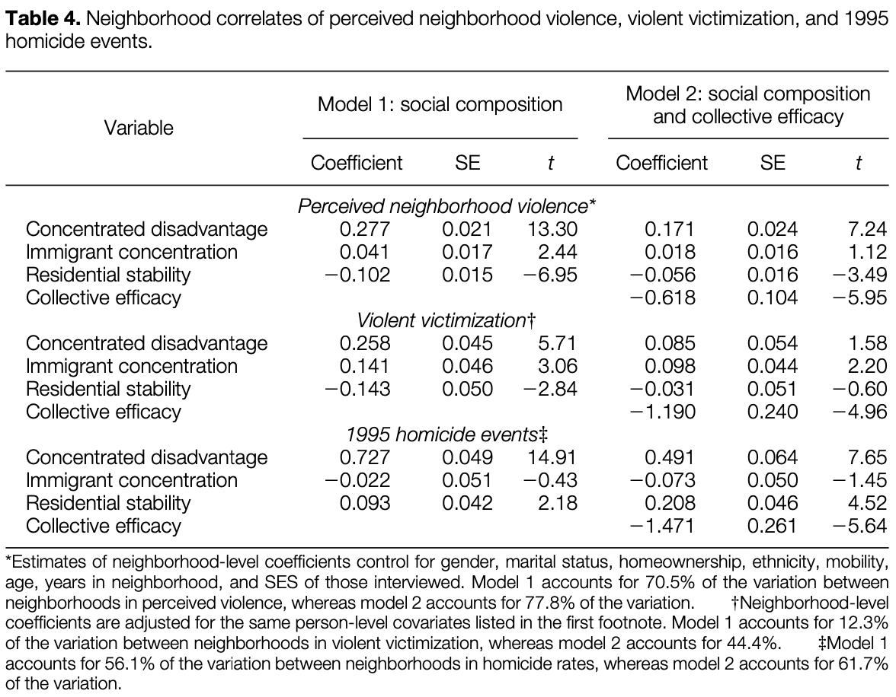

```{r setup, include = FALSE}
library(RefManageR)
library(knitr)
library(tidyverse) # Just check it out: www.tidyverse.org
library(dagitty) # Use the dagitty package
library(ggdag) # Neat visualization of DAGs
library(plotly)
library(gapminder)
library(sjstats)

options(htmltools.dir.version = FALSE, servr.interval = 0.5, width = 115, digits = 2)
knitr::opts_chunk$set(
  collapse = TRUE, message = FALSE, fig.retina = 3,
  warning = FALSE, cache = FALSE, fig.align='center',
  comment = "#", strip.white = TRUE)

BibOptions(check.entries = FALSE, 
           bib.style = "authoryear", 
           style = "markdown",
           hyperlink = FALSE,
           no.print.fields = c("doi", "url", "ISSN", "urldate", "language", "note", "isbn", "volume"))
myBib <- ReadBib("./../../../Adv-WIM.bib", check = FALSE)

xaringanExtra::use_xaringan_extra(c("tile_view", "tachyons"))
xaringanExtra::use_panelset()
```
class: clear
# .font60[What is the research question of `r Citet(myBib, "sampson_neighborhoods_1997")`?]

```{r echo = FALSE, fig.width = 7, fig.height = 4, out.width= "70%"}
dagify( # Define the DAG
  # Define the theoretical causal model
  Crime ~ Res_stab + SES_Depri,
  # Add labels
  labels = c("Res_stab" = "Residential \n Instability", 
             "SES_Depri" = "SES \n Deprivation",
             "Crime" = "Crime"),
  # exposure = "Nbh_YCCR", # define treatment
  outcome = "Crime", # define outcome
  # Specify coordinates for the graph
  coords = list(
    x = c(Res_stab = 0, SES_Depri = 0, Crime = 1),
    y = c(Res_stab = 1, SES_Depri = -1, Crime = 0))) %>%
  # Visualize it
  ggdag(., text = FALSE, use_labels = "label") +
  theme_dag()
```

---
layout: true
# Collective Efficacy

.right-column[
```{r echo = FALSE, fig.width = 6, fig.height = 4, out.width= "100%"}
dagify( # Define the DAG
  # Define the theoretical causal model
  Crime ~ Coll_eff,
  Coll_eff ~ Res_stab + SES_Depri,
  # Add labels
  labels = c("Res_stab" = "Residential \n Instability", 
             "SES_Depri" = "SES \n Deprivation",
             "Crime" = "Crime",
             "Coll_eff" = "Collective \n Efficacy"),
  # exposure = "Nbh_YCCR", # define treatment
  outcome = "Crime", # define outcome
  # Specify coordinates for the graph
  coords = list(
    x = c(Res_stab = 0, SES_Depri = 0, Coll_eff = 0.5, Crime = 1),
    y = c(Res_stab = 1, SES_Depri = -1, Coll_eff = 0, Crime = 0))
) %>%
  # Visualize it
  ggdag(., text = FALSE, use_labels = "label") +
  theme_dag()
```
]

---

---
.left-column[
Research question: Does a lack of Collective Efficacy explain why unstable and deprived areas have higher crime rates?

.content-box-blue[
Collective Efficacy =
- Informal social control:
  + Willingness to intervene.
- Social Cohesion and trust:
  + Mutual trust,
  + Dense networks,
  + Shared norms.
]]

---
layout: false
class: clear

.left-column[
<br>
<br>
.font170[
.alert[Composition 

versus 

Context Effects]]

.content-box-green[
What distinguishes a context from a composition effect?
]
]

.right-column[
```{r echo = FALSE, out.width= "50%"}
set.seed(8383)

gr_size <- 10
shift <- 0.4

# Frame 1
x1 <- c(rnorm(gr_size, mean=1, sd=0.15), rnorm(gr_size, mean=1, sd=0.15))
y1 <- c(rnorm(gr_size, mean=0.8, sd=0.1), rnorm(gr_size, mean=2.2, sd=0.1))
# Frame 2
x2 <- x1 
y2 <- y1 + c(rep(0, shift * gr_size), rep(1.4, (1 - shift) * gr_size), rep(0, gr_size))

# Society 2
add_x <- c(rnorm(gr_size, mean=3, sd=0.15), rnorm(gr_size, mean=3, sd=0.15))
add_y <- rnorm(2 * gr_size, mean = 1.8, sd = 0.1)

# Frame 3
x3 <- c(x2, add_x) 
y3 <- c(y2, y2 + add_y)
# Frame 4
x4 <- c(x1, add_x)
y4 <- c(y1, y1 + add_y)

df <- tibble(
  x = c(x1, rep(NA, 2 * gr_size), 
        x2, rep(NA, 2 * gr_size),
        x3,
        x4),
  y = c(y1, rep(NA, 2 * gr_size), 
        y2, rep(NA, 2 * gr_size),
        y3,
        y4),
  f = c(rep(1, 4 * gr_size), 
        rep(2, 4 * gr_size), 
        rep(3, 4 * gr_size),
        rep(4, 4 * gr_size)),
  work = c(rep(1, gr_size), rep(2, gr_size), rep(NA, 2 * gr_size),
           rep(1, shift * gr_size), rep(2, ((1 - shift) * gr_size) + gr_size), rep(NA, 2 * gr_size),
           rep(1, shift * gr_size), rep(2, ((1 - shift) * gr_size) + gr_size), rep(1, shift * gr_size), rep(2, ((1 - shift) * gr_size) + gr_size),
           rep(1, gr_size), rep(2, gr_size), rep(1, gr_size), rep(2, gr_size))
)

df2 <- tibble(
  x = c(1, 1, 1, 3, 1, 3),
  y = c(mean(y1), mean(y2), mean(y2), mean(y2 + add_y), mean(y1), mean(y1 + add_y)),
  f = c(1, 2, 3, 3, 4, 4)
  )

(base <- plot_ly(
  x = ~x,
  y = ~y,
  frame = ~f,
) %>%
    add_markers(data = df, color = ~work, showlegend = F, marker = list(
      opacity = 0.7,
      size = 12,
      showlegend = F,
      type = 'scatter',
      mode = 'markers',
      colorscale = list(c(0, "#7570b3"), list(1, "#1b9e77"))
    )) %>%
    add_text(data = df2, text = "Y.", showlegend = F, marker = list(
      opacity = .4,
      size = 25,
      showlegend = F,
      color = "#d95f02"
    )) %>%
    layout(
      margin = list(
        l = 110,
        r = 50,
        b = 50,
        t = 50,
        pad = 14
      ),
      width = 800, 
      height = 600,
      xaxis = list(
        showlegend = FALSE,
        title = "",
        zeroline = FALSE,
        showline = FALSE,
        range = c(0, 4),
        ticktext = list("Neighborhood 1", "Neighborhood 2"), 
        tickvals = list(1, 3)
      ), 
      yaxis = list(
        title = "Violent crime",
        ticktext = list("Regularly", "Sometimes", "Rarely", "Never"), 
        tickvals = list(1, 2, 3, 4),
        range = c(0, 5),
        tickmode = "array")
    ) %>% 
    animation_opts(
      2500, easing = "elastic", redraw = FALSE
    ) %>%
    hide_colorbar())
```
]

---
# Examples

.push-left[
.content-box-green[
Consider Composition and Context Effects for the following hypotheses with your neighbor:
- H1: The more elderly residents live in a neighborhood, the fewer house parties.
- H2: The more house owners live in a neighborhood, the lower the crime rate.
- H3: Come up with an exemplary hypothesis of your own.
]]

.push-right[
```{r, echo = FALSE, out.width='100%', fig.align='center'}
knitr::include_graphics('https://c.tenor.com/ZH8sBDd1cZwAAAAM/parrrrty-party.gif')
```
]

---
# Collective Efficacy as Context Effect

.left-column[
.font170[
.alert[Micro and 

Macro level
]]]

.right-column[
```{r micmac, echo = FALSE, fig.width = 6, fig.height = 4, out.width= "100%"}
dagify( # Define the DAG
  # Define the theoretical causal model
  Crime ~ Coll_eff + X,
  Coll_eff ~ Res_stab + SES_Depri,
  # Add labels
  labels = c("X" = "Person-level \n predictors \n (e.g., gender)",
             "Res_stab" = "Residential \n Instability", 
             "SES_Depri" = "SES \n Deprivation",
             "Crime" = "Crime",
             "Coll_eff" = "Collective \n Efficacy"),
  # exposure = "Nbh_YCCR", # define treatment
  outcome = "Crime", # define outcome
  # Specify coordinates for the graph
  coords = list(
    x = c(Res_stab = 0, SES_Depri = 0, Coll_eff = 0.5, X = 0.5, Crime = 1),
    y = c(Res_stab = 1, SES_Depri = -1, Coll_eff = 0, X = -3, Crime = -3))
) %>%
  # Visualize it
  ggdag(., text = FALSE, use_labels = "label") +
  geom_hline(yintercept = -1.5, lty = "dashed") +
  theme_dag()
```
]

---
# Results .font70[What is the key takeaway from this table?]

.push-left[
```{r, echo = FALSE, out.width='100%', fig.align='center'}

```
.center[.backgrnote[*Source:* `r Citet(myBib, "sampson_neighborhoods_1997")`]]
]

.push-right[
```{r ref.label= "micmac", echo = FALSE, fig.width = 6, fig.height = 4, out.width= "100%"}
```
]

---
background-image: url('https://www.quartiersmanagement-berlin.de/fileadmin/content-media/Gebietsgalerien/114_Zentrum_KB_Kottbusser_Tor__Cansu_Cakmak_.jpg')
background-size: cover
class: center middle

.font150[.center[.alert[**Given all these insights,**<br> **Why are such large-scale modernizations problematic?**]]]


---
layout: false
# Group discussion

.push-left[
.content-box-green[
Taken as inequality-generating mechanisms, 
how can Coleman's and Lin's social capital theories help us explain Topic 1-3?
]

<br>

Mechanism |  Power | Gender gap | Social mobility 
-------------------|---------|---------|--------
Coleman | Group 1 | Group 3 | Group 5 
Lin | Group 2 | Group 4 | Group 6


]

.push-right[
```{r, echo = FALSE, out.width='80%'}
knitr::include_graphics('https://www.educationworld.in/wp-content/uploads/2018/04/gd.jpg')
```
]

---
# References

.font80[
```{r ref, results = 'asis', echo = FALSE}
PrintBibliography(myBib)
```
]
