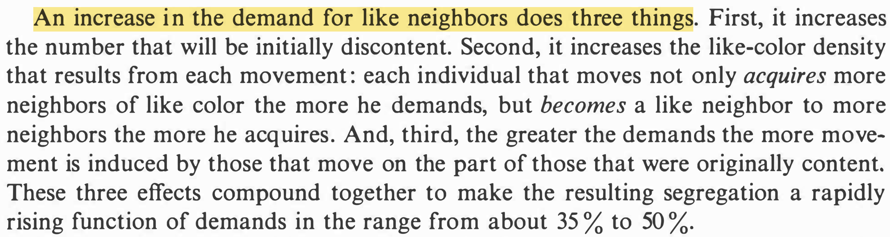
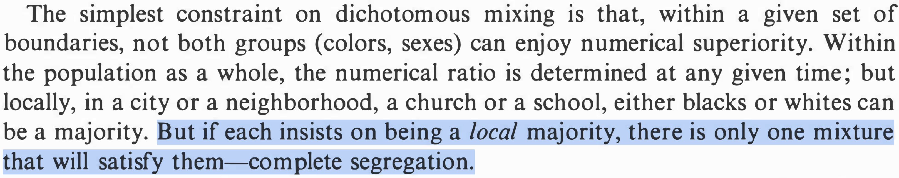
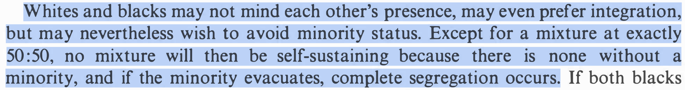
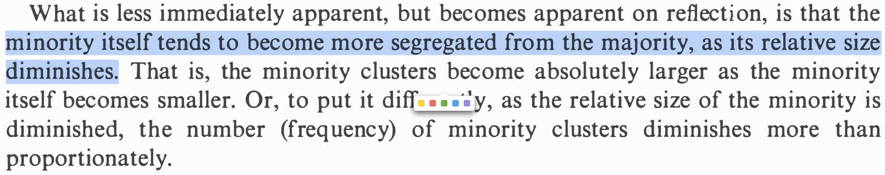
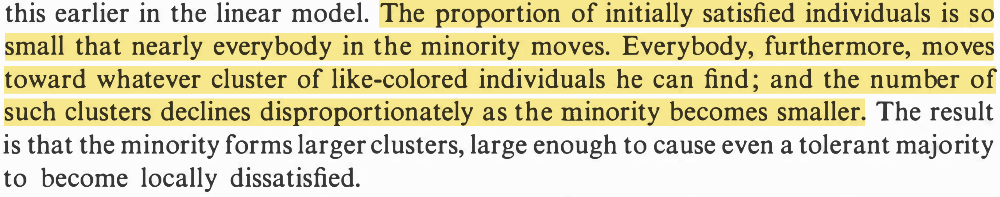
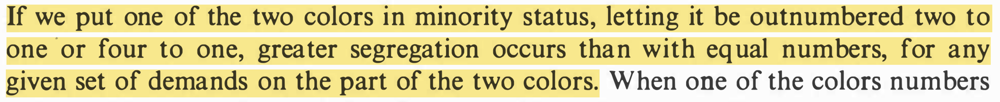
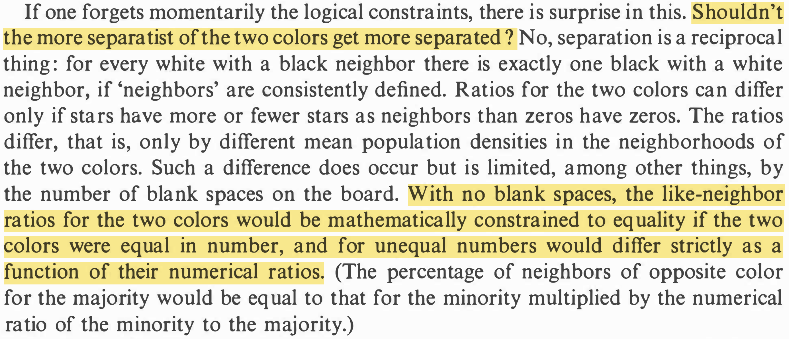

```{r setup, include = FALSE}
library(RefManageR)
library(knitr)
library(tidyverse) # Just check it out: www.tidyverse.org
library(dagitty) # Use the dagitty package
library(ggdag) # Neat visualization of DAGs

options(htmltools.dir.version = FALSE, servr.interval = 0.5, width = 115, digits = 2)
knitr::opts_chunk$set(
  collapse = TRUE, message = FALSE, fig.retina = 3,
  warning = FALSE, cache = FALSE, fig.align='center',
  comment = "#", strip.white = TRUE)

BibOptions(check.entries = FALSE, 
           bib.style = "authoryear", 
           style = "markdown",
           hyperlink = FALSE,
           no.print.fields = c("doi", "url", "ISSN", "urldate", "language", "note", "isbn", "volume"))
myBib <- ReadBib("./../../../Adv-WIM.bib", check = FALSE)

xaringanExtra::use_xaringan_extra(c("tile_view", "tachyons"))
xaringanExtra::use_panelset()
```
# Let's play

.left-column[
```{r, echo = FALSE, out.width='100%'}
knitr::include_graphics('https://upload.wikimedia.org/wikipedia/commons/thumb/e/e7/Zapalky_makrofoto.jpg/440px-Zapalky_makrofoto.jpg')
```
]
.right-column[
.center[**Rules**]
1. Break matches into heads and tails. Decide who plays which.
2. Align heads and tails according to this sequence:
.font70[
```{r}
rbinom(n = 36, size = 1, prob = 0.5)
```
]
2. Decide who plays heads and who plays tails.
3. A "Neighborhood" is defined as $\pm 3 \rightarrow$ 1 0 1 **1** 0 0 0.
4. At least two of every actor's six neighbors shall be in-group, otherwise an actor is unhappy.
5. An unhappy actor moves right to the nearest position where she would be satisfied and squeezes in.
6. Take turns until every actor is satisfied.
7. How many of your actors live more segregated than the minimum rule (i.e. two neighbors are in-group) demands?
]


---

<iframe src='file:///Users/fsm788/Downloads/Segregation.html' width='1200' height='600' frameborder='0' scrolling='yes'></iframe>
<!-- .center[.backgrnote[`r Citet(myBib, "mccown_schellings_nodate")`]] -->

---
# Groupwork

.left-column[
.content-box-green[
The `r Citet(myBib, "schelling_dynamic_1971")` model is a simplification. But it yields important insights with policy implication!

Thus, go through the text. Which insight did you find most important and why?
]]

---
layout: true
# Insights


---

.push-right[
```{r, echo = FALSE, out.width='100%'}

```

.content-box-blue[.center[
$\rightarrow$ Why homophily results in more segregation than individually intended.
]]
]

---

.push-right[
```{r, echo = FALSE, out.width='100%'}

```
.center[[...]]
```{r, echo = FALSE, out.width='100%'}

```

.content-box-blue[.center[
$\rightarrow$ A universal preference for 51% own group already leads to perfect segregation.
]]
]

---

.push-right[
```{r, echo = FALSE, out.width='100%'}

```
.center[[...]]
```{r, echo = FALSE, out.width='100%'}

```

.content-box-blue[.center[
$\rightarrow$ Minority status itself leads to stronger segregation, *ceteris paribus*.
]]
]

---

.push-right[
```{r, echo = FALSE, out.width='100%'}

```

.content-box-blue[.center[
$\rightarrow$ It is more difficult to integrate small minorities.
]]]

---

.push-right[
```{r, echo = FALSE, out.width='100%'}

```

.content-box-blue[.center[
$\rightarrow$ Politician's focus on immigrants and their descendants in "Ghettos" is unbalanced.
]]]


---
layout: false
# References

.font80[
```{r ref, results = 'asis', echo = FALSE}
PrintBibliography(myBib)
```
]
